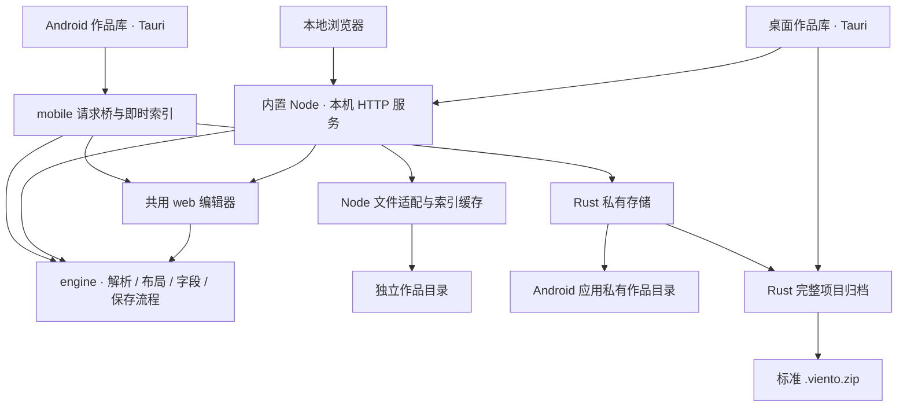

# 系统架构

本文描述 **b.4.6** 的模块职责与数据流。Viento Studio 由共用编辑器和引擎、桌面 / 浏览器适配、Android 适配组成；作品类型、模板与字段规则来自项目清单。

[文档中心](README.md) · [验证状态](TESTING.md) · [引擎接口](../engine/README.md)

## 模块边界

| 目录 | 职责 |
| --- | --- |
| `web/` | 阅读与编辑界面、草稿控制器、素材和导出交互、三语词典 |
| `engine/` | 解析、布局、字段修改、素材引用、文档模型与存储流程；不读取本机配置，不依赖 Node、HTTP 或 Tauri |
| `scripts/adapters/` | Node 文件存储适配：定位、快照、串行写入与登记 |
| `scripts/lib/`、`scripts/ops/` | 本机服务、转换与索引、素材登记、导出、本机配置及启动编排 |
| `desktop/` | 作品库首页、运行环境准备、源码打包、清理和 Linux 原生测试 |
| `mobile/` | Android 作品库、请求桥、即时索引、恢复草稿与移动布局 |
| `src-tauri/src/` | 原生作品库和归档、窗口与进程生命周期、移动存储及迁移命令 |
| `src-tauri/gen/android/` | 受版本控制的 Android 源工程、窗口边界与系统文档选择插件 |
| `schemas/` | 项目清单、文档类型与登记的格式定义 |

原有解析入口保留兼容转发；核心实现集中在 `engine/`，不能反向依赖宿主入口。YAML 解析依赖随应用离线提供。



图中的共用编辑器通过当前宿主的请求接口工作；Android 的接口适配在 WebView 内完成，不启动 Node 或本机 HTTP 服务。

## 项目数据是唯一来源

新建 v3 项目的 `workspace.json` 声明正文、模板、元数据、素材目录及文档类型；默认目录为 `documents/`、`templates/`、`metadata/`、`assets/`。旧 v1 / v2 桌面作品原位兼容，不因更新程序改名或重排源文件。

- 文档和素材用稳定 UUID 登记。路径用于定位，名称用于展示；背景故事用 `part-of` 归属档案，共享故事可有多个归属。
- 模板提供新文档的起始正文。类型解析规则和字段分组控制解释与展示，不把模板重写进旧文档，也不执行模板脚本。
- 正文中的项目路径使用 `/` 分隔的相对逻辑路径，素材可用 `asset:<UUID>` 引用；本机绝对路径和 Android `content://` 句柄不写入作品正文。
- 桌面标准化文件、索引与临时导出集中在 `.viento/cache/`，属于派生数据。Android 索引按当前文件即时生成。
- `.viento/local.json` 记录本机外置素材绑定，不进入迁移包。应用偏好、最近作品与恢复草稿也不等同于作品备份。

格式详情见 [通用项目](GENERIC_PROJECTS.md)、[文档模型](OC_DOCUMENT_MODEL.md) 和 [作品库布局](WORKSPACE_LAYOUT.md)。

## 桌面与浏览器链路

Tauri 作品库启动随附 Node 和 `scripts/desktop-server.mjs`，处理服务绑定本机随机端口，使用每次启动独立的会话凭据、Cookie 和来源检查。编辑 WebView 不直接取得原生文件或 Shell 权限；桌面保存通过受校验的桥交给宿主。普通浏览器由 `scripts/ops/site.mjs` 启动同一服务，浏览模式不开放正文及项目配置写入。

```text
作品清单 + 源文件 + 登记
    → standardize-docs → 通用解析与布局
    → build-static-doc-site → .viento/cache/indexes/
    → data/index.json → 文档列表与阅读器

编辑草稿 → 文档接口 → engine/document-store
    → Node 文件适配 → 版本检查 / 原子写入 / 新建登记
    → 标准化与索引刷新 → 当前编辑器
```

可编辑目录由已验证的项目配置决定，不固定为旧作品的 `design-data/`。编辑器读取的 `data/index.json` 是索引资源入口；服务另提供 `/api/index`，两者不应在调用说明中混为同一请求。

接口契约集中在 `engine/document-contract.mjs`，旧 `scripts/lib/doc-api-contract.mjs` 保留转发。路由、文档服务、文件存储、项目设置、素材和导出分别处理各自职责。`/api/health` 和 `/api/metrics` 用于诊断，启动及检查时执行契约校验。

保存正文和刷新索引是两个步骤。正文写入成功后即使刷新失败，也保留保存结果并允许重试；版本冲突保留当前草稿，不能把旧内容静默覆盖到新版本上。源码、分段和字段表共享同一份草稿，字段修改只回写对应的值片段。

桌面返回作品库可保留本次编辑窗口的草稿；关闭时检查未保存状态。它不提供与 Android 相同的进程退出后草稿恢复保证。引擎退出及索引子进程回收完成后才释放作品会话锁，详见 [桌面宿主](../desktop/README.md)。

## Android 链路

```text
mobile 作品库 → 作品 UUID
    → mobile/platform.mjs → 共用编辑器与 engine
    → Tauri mobile_storage → Rust 存储锁与路径校验
    → app_data_dir()/workspaces/<作品>/
```

原生命令只接受作品 ID 和逻辑源路径，不接受任意磁盘目录。保存核对 SHA-256 修订号，使用同目录临时文件和原子替换。新建文档先持久化正文及登记的创建意图，进程中断后按同一身份恢复；已有不同内容的文件不会被覆盖。

WebView 本机存储按作品保存草稿及原始修订号；恢复后继续进行冲突检查。恢复副本不进入项目包，卸载或清除应用数据会失去私有作品和草稿。

原生窗口处理系统栏、刘海与软键盘边界，并通知 WebView 已消费的边界，避免遮挡或重复留白；编辑页面使用整页滚动。迁移选择器返回后，插件等待 Activity 恢复再在主线程交付结果，避免取消回执滞留。

当前已接入编辑、语言设置和完整迁移。媒体访问与插入、项目类型配置、文档分享导出仍未接入；不能根据共用引擎存在这些接口就宣称移动端已经支持。设备和容量边界见 [Android 说明](../mobile/README.md)。

## 分享与完整迁移

桌面 / 浏览器分享链路为：选择文档与附属内容 → 通用布局 → HTML / Markdown → 收集稳定引用及绑定素材 → 流式 ZIP → 下载或原生保存。完整项目包包含清单、模板、正文、全部登记和素材，排除本机绑定及缓存。

桌面原生作品库使用 Rust 归档；编辑器完整导出使用 Node 实现，两者通过往返测试对齐。Android 复用 Rust 归档，增加移动容量限制和系统文档选择适配；外部 URI 只用于传输，导入先暂存校验再发布到私有作品库，同一作品拒绝覆盖。

归档检查包内摘要，也核对正文和素材登记、关系、路径冲突与导出期间的源文件变化。文件成功写完后才替换正式备份；失败撤回本次恢复目录。下载完成按实际成功响应判断，未完成的包保留重试机会。详见 [导出契约](EXPORT.md)。

## 检查与追踪

当前覆盖、命令及剩余验证见 [验证指南](TESTING.md)。[功能网络及交互图](FUNCTION_NETWORK.md) 是 b.4.3 的桌面历史快照，保留原来的枚举和证据；本文与 Android 说明补充其后的架构变化。历史记录中的“未验证”只描述记录当时的状态。
