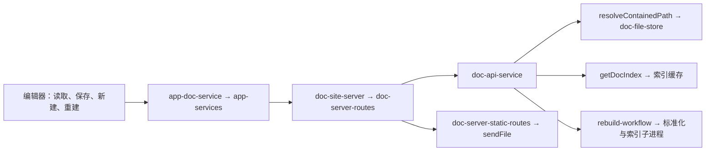

# b.2.8 调用链故障排查

2026-09-09。本轮从编辑器入口追踪到 HTTP 路由、文档服务、文件写入及重建子进程，保留 b.2.8 发布编号。复现使用临时作品、临时链接与本机测试服务。

## 已复现并修复的衔接问题

| 调用链 | 问题 | 修复 |
| --- | --- | --- |
| 文档读写 / 静态读取 → 路径解析 → 文件系统 | 接口只限制了路径文字，父目录链接仍能将读、保存或新建导向作品外；静态文档地址还可通过链接读取服务端模块 | 对选定根目录下的每一级路径检查链接，包括新文件的已有父目录；正文、模板、缓存、素材和图标读取使用一致的边界检查，保留显式外置素材绑定 |
| HTTP 请求 → URL 解析 / 首页读取 | 非法请求目标或首页文件读取失败使异步处理函数拒绝，未捕获异常会让整个编辑服务退出 | URL 错误返回 400；顶层捕获请求失败并返回 500，已开始传输时只终止当前响应。错误响应改为同步函数，调用方可以捕获发送异常 |
| 保存 / 模板读取 → fetch → 读取响应体 | 收到响应头就清除了超时计时，响应体迟迟不完成时界面持续等待；超时处理直接改写只读 DOMException.message 又引发 TypeError；传入的取消信号被覆盖 | 超时覆盖响应体读取，单独构造超时错误并保留请求记录；保留调用者的取消信号和原因，取消与超时分别显示 |
| 保存成功 → 缓存失效 → 较早启动的索引扫描返回 | 旧扫描能重新写入失效后的缓存，保存后读取目录仍遗漏新文档 | 缓存使用递增代次；保存后的请求开始新扫描，旧结果和旧任务的清理都不能覆盖当前代次 |
| 部分重建 API → 参数归一化 → 转换器清理 | 非法 source 被归一化为空字符串，静默变成全量重建并清理整个生成目录 | 区分明确的全量请求与非法过滤条件；错误路径、类型在启动子进程和修改缓存前返回 400 |
| rebuildIndex(projectRoot) → 子进程环境 → paths | 子进程保留父进程的旧 VIENTO_WORKSPACE_ROOT，显式选择 B 作品却重建了 A 作品 | 将实际选定的作品根传给两个子进程，并保持默认旧式目录的输出兼容 |

10 个新增回归用例在修复前全部失败，修复后全部通过。用例位于 [call-paths.test.mjs](../scripts/tests/call-paths.test.mjs) 和 [request-lifecycle.test.mjs](../scripts/tests/request-lifecycle.test.mjs)，通过真实文件操作、HTTP 请求和可控的扫描延迟验证调用顺序。

原生桌面流程另检查已认证编辑器中的错误请求恢复、无效重建拒绝和库外链接隔离，再继续源文/区块切换、保存、返回作品库与关闭流程。完整测试、交付包及作品清单校验结果写入 `dist/current/verification.json`。

作品正文、大纲、元数据和素材继续与现有完整迁移包逐文件校验；程序源码与 Linux AppImage 更新到同一份 b.2.8 修复结果，交付不积累重复素材包。作品和整库迁移包随后移入了系统应用数据目录，见 [本机数据目录](LOCAL_DATA_STORAGE.md)。
