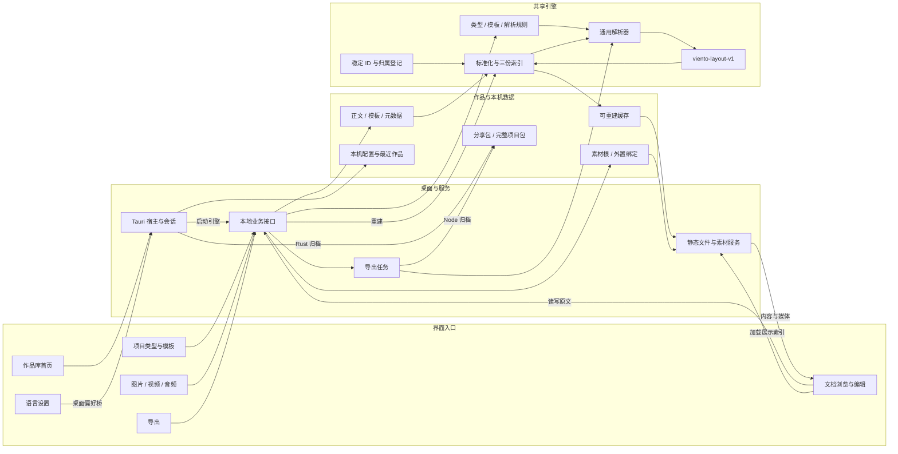
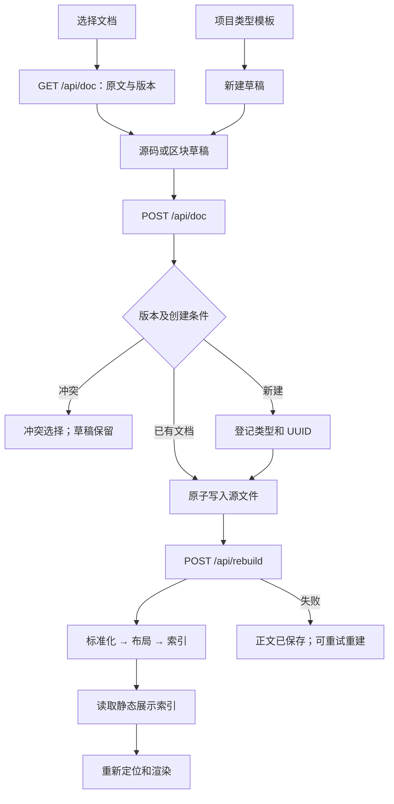
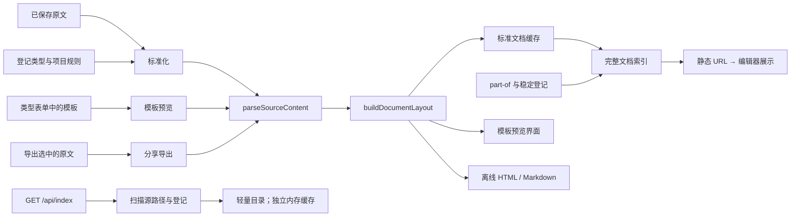
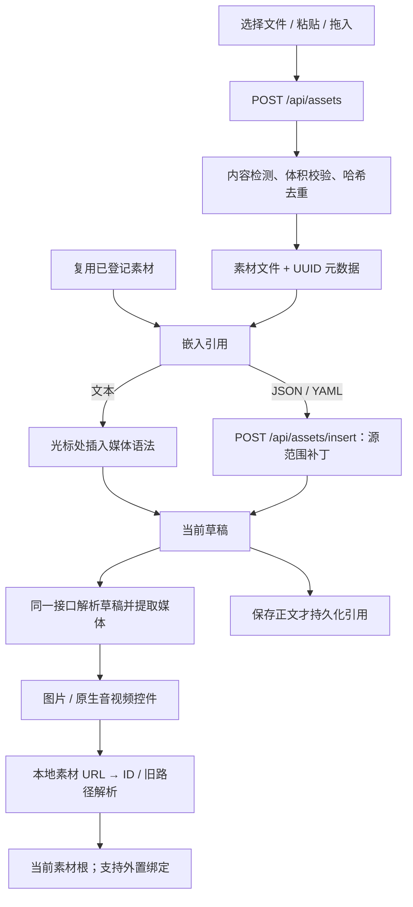
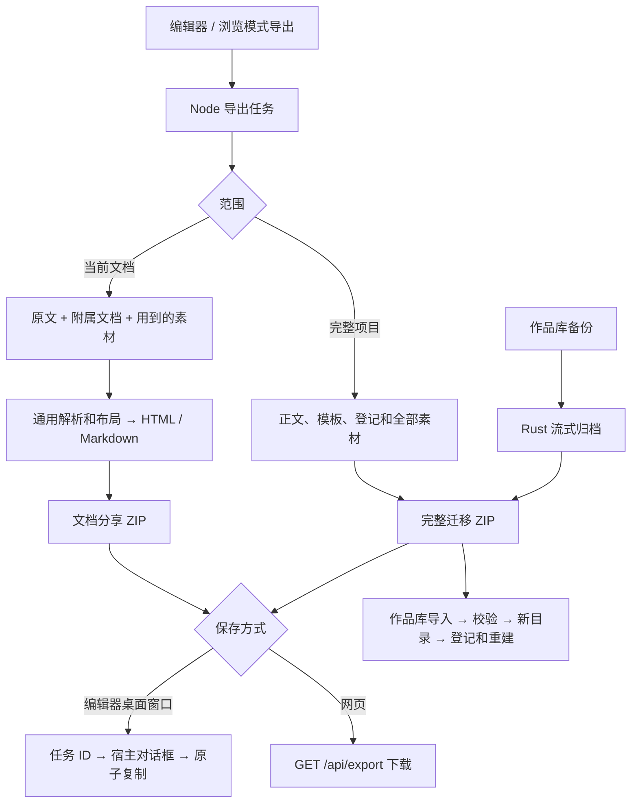
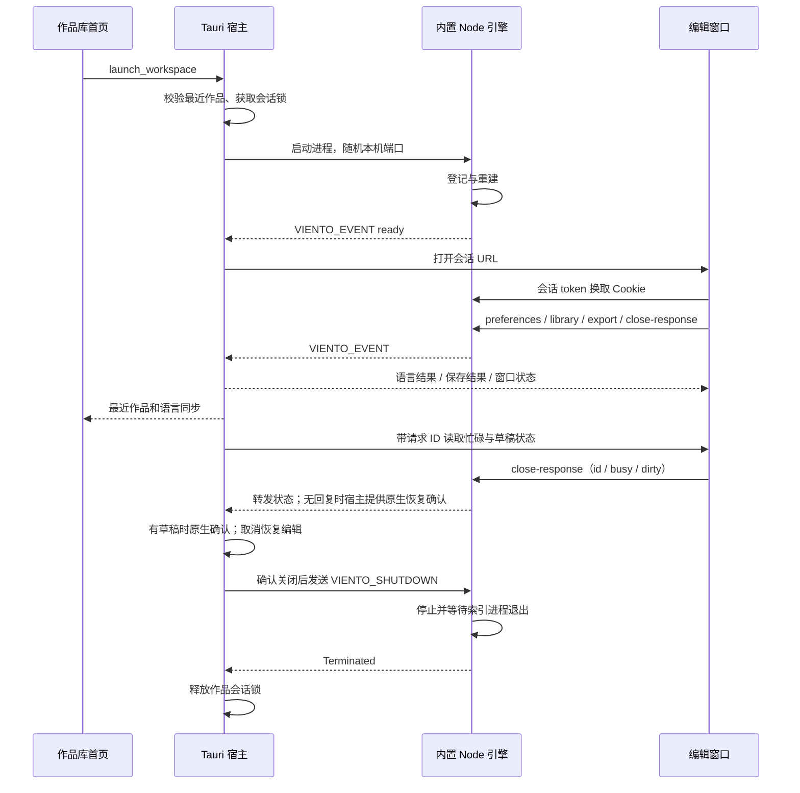

# Viento Studio 功能链路网络

此页枚举 **2026-09-23、b.3.3** 的实际功能入口、业务步骤、接口和数据落点，包含音频支持、类型取消/返回及[按图排查的十八轮修复](NETWORK_BUGFIX_b.2.8.1.md)。此为修订 25，接续素材预览与编辑切换快照，同步 [b.3.3 发布清单](RELEASE_b.3.3.md)。JSON 保留此前源码、发布清单和验证证据；本次发布在 `ca8a8d8` 基础上收录第十七、十八轮修复。最初基线为 `51d522cb919c20b15815b129bd62e859af9a97a0`。

- [离线交互浏览器](function-network.html)：筛选业务链路，点击节点查看上下游，查询真实模块导入及接口。下载后双击即可使用，不访问外网。
- [机器可读快照](function-network.json)：完整节点、边、源码引用、模块导入、事件绑定、路由、命令和扫描文件指纹。
- [总图 Mermaid 源文件](function-network.mmd)：可在支持 Mermaid 的工具中继续编辑。

## 1. 范围与读图方式

| 统计项 | 数量 |
| --- | ---: |
| 已枚举业务链路 | 50 |
| 功能及数据节点 | 66 |
| 业务步骤连接（去重） | 173 |
| 扫描代码文件（JS / MJS / Rust / Python / Shell） | 146 |
| 其中 JavaScript 模块 | 126 |
| 本地模块导入语句 | 375 |
| 字面量事件名的显式事件绑定 | 95 |
| 业务 HTTP 路径 / 方法组合 | 11 / 16 |
| 桌面桥路径 / 方法组合 | 5 / 6 |
| 原生首页命令 | 11 |
| 作品维护 CLI 子命令 | 7 |

业务图的箭头表示请求、数据传递或处理步骤；同一节点可以再次出现，且分支可能在文字中展开。**它不是逐函数调用图**。JSON 的 `moduleImports` 才是代码中实际声明的本地导入；它也不能表示调用次数或性能。桌面归档示例 CLI 另有 4 个操作，不计入 7 个作品维护命令。

网络从代码静态梳理，不是运行时追踪。本轮 app-only 检查共 258 项，257 项通过、1 项原生归档互通跳过。此前的 [编辑器](NATIVE_WORKFLOW_TEST_b.2.8.1.md)、[作品库](NATIVE_LIBRARY_TEST_b.2.8.1.md) 与 [导出](NATIVE_EXPORT_TEST_b.2.8.1.md) 原生实测记录继续保留，本轮没有重跑。每条链路附的“已有验证入口”不代表该链路所有运行状态均已覆盖。测试使用临时作品，没有修改日常作品。业务枚举按职责归并，并不声称覆盖所有运行时状态组合。

## 2. 总体网络

程序安装包提供宿主、界面、服务和引擎；每个作品持有自己的内容、类型与素材。日常浏览读取生成索引，编辑读取源文件，保存后再重建展示。权威正文不会从展示 JSON 反向恢复。

## 3. 关键分支图

### 3.1 编辑、保存与索引刷新

源码保存与展示重建是两个阶段。新建成功后，即使重建失败，界面也应按已有文档继续工作。取消、切换、返回和关窗分别读取当前草稿与忙碌状态。

### 3.2 三处共用解析，以及两种索引

**当前界面加载路径不是 `/api/index`**：`getDataIndexUrlCandidates()` 依次尝试页面相对 `data/index.json`、`/web/data/index.json`、`/data/index.json`，去掉重复项。`/web/data/index.json` 映射到作品的完整索引；v2/v3 为 `.viento/cache/indexes/documents.json`。

`/api/index` 的 `buildEditableDocIndex()` 只扫描文件路径、登记类型、修改时间和图片关联，不解析正文、不生成 layout、不附加归属树。它的默认 5 秒缓存与完整展示索引是不同的数据通道。

### 3.3 媒体导入、嵌入与播放

导入素材会先落盘；放弃文档草稿并不自动删除已经导入的文件。取消导入也覆盖后续结构化补丁请求；应用响应前核对草稿，迟到结果不覆盖新的编辑状态。图片、视频和音频共用引用与导出链路；媒体预览调用解析器提取媒体，不经过通用卡片布局。元数据 `assetBindings` 进入登记、索引及导出附件清单；当前索引的图片补全只取 image，绑定音视频本身不等于正文已插入播放器。

### 3.4 分享、完整迁移与两种归档实现

作品库备份直接通过 Rust 写用户选择的目的文件；编辑器的 Node 任务先写暂存包，再下载或交给宿主保存。只有完整迁移包支持作品库恢复；文档分享包用于阅读。浏览模式也开放导出接口，只写导出缓存，不提供正文写入。

### 3.5 桌面会话与语言

首页通过 11 个原生命令操作作品。编辑网页通过受限本机会话桥交给宿主处理原生动作；返回作品库隐藏原编辑窗口，继续编辑复用同一草稿。关闭才结束窗口与引擎。语言同步先订阅再读取，迟到的读取/保存结果不覆盖新通知；超时允许重试并中止未完成请求，已提交选择以实际通知为准。普通网页重新读取当前 localStorage，同步删除与清空事件。

## 4. 完整业务枚举

节点名称可跳到后面的职责与代码表。同一业务中的数据节点表示读取或写入落点，具体副作用和条件以文字为准。

### 作品库与桌面

#### F01 · 启动与最近作品

入口：启动桌面应用。

[Tauri 桌面宿主](#node-host) → [作品库首页](#node-library) → [原生语言偏好](#node-native_language) → [本机配置与最近作品](#node-local_config) → [作品库首页](#node-library)

先订阅语言通知，再读取版本、语言、最近作品与活动窗口状态；启动中的旧读取不会覆盖新选择。 未打开项目时不会启动该作品的 Node 服务。

已有验证入口：[scripts/tests/i18n.test.mjs](../scripts/tests/i18n.test.mjs)、[desktop/tests/native-smoke.py](../desktop/tests/native-smoke.py)、[scripts/tests/settings.test.mjs](../scripts/tests/settings.test.mjs)、[src-tauri/src/lib.rs](../src-tauri/src/lib.rs)。

#### F02 · 新建空白项目

入口：作品库 → 新建作品库。

[作品库首页](#node-library) → [Tauri 桌面宿主](#node-host) → [原生作品与归档](#node-native_workspace) → [项目清单](#node-manifest) → [项目模板](#node-templates) → [原始正文](#node-documents) → [素材原文件](#node-assets) → [本机配置与最近作品](#node-local_config)

创建通用 v3 目录、六个默认类型/模板，登记最近作品。 已有编辑窗口时，首页禁用入口，宿主在原生选择器、写文件及登记前拒绝切换。正文初始为空；取消原生目录选择不创建项目。

已有验证入口：[scripts/tests/generic-project.test.mjs](../scripts/tests/generic-project.test.mjs)、[src-tauri/src/workspace.rs](../src-tauri/src/workspace.rs)、[desktop/tests/native-library.py](../desktop/tests/native-library.py)、[scripts/tests/desktop-library.test.mjs](../scripts/tests/desktop-library.test.mjs)。

#### F03 · 选择已有作品

入口：作品库 → 打开已有文件夹。

[作品库首页](#node-library) → [Tauri 桌面宿主](#node-host) → [原生作品与归档](#node-native_workspace) → [项目清单](#node-manifest) → [本机配置与最近作品](#node-local_config)

验证/兼容已有作品并记录位置，然后进入打开链路。 已有编辑窗口时，首页禁用入口，宿主在原生选择器、写文件及登记前拒绝切换。兼容 v1/v2/v3；不把旧作品强行搬为新目录。

已有验证入口：[scripts/tests/desktop-workspace.test.mjs](../scripts/tests/desktop-workspace.test.mjs)、[src-tauri/src/workspace.rs](../src-tauri/src/workspace.rs)、[desktop/tests/native-library.py](../desktop/tests/native-library.py)、[scripts/tests/desktop-library.test.mjs](../scripts/tests/desktop-library.test.mjs)。

#### F04 · 打开作品和启动引擎

入口：最近作品 → 打开。

[作品库首页](#node-library) → [Tauri 桌面宿主](#node-host) → [桌面内置服务启动](#node-boot) → [文档与素材登记](#node-registry) → [标准化与索引重建编排](#node-rebuild) → [编辑 HTTP 服务](#node-edit_server) → [桌面会话与事件桥](#node-session) → [编辑器状态与导航](#node-editor)

获取 .viento/session.lock；登记、重建，等待 ready 事件后打开随机本机端口。 已有编辑窗口时先结束当前会话；启动前即监听宿主退出，失败或关闭时停止并回收索引进程。

已有验证入口：[desktop/tests/native-smoke.py](../desktop/tests/native-smoke.py)、[scripts/tests/workspace-layout.test.mjs](../scripts/tests/workspace-layout.test.mjs)、[scripts/tests/desktop-workspace.test.mjs](../scripts/tests/desktop-workspace.test.mjs)、[desktop/tests/native-library.py](../desktop/tests/native-library.py)、[scripts/tests/desktop-library.test.mjs](../scripts/tests/desktop-library.test.mjs)。

#### F05 · 打开系统文件夹

入口：最近作品 → 文件夹。

[作品库首页](#node-library) → [Tauri 桌面宿主](#node-host) → [原始正文](#node-documents)

由原生 opener 展示已经登记的作品目录。 输入路径必须属于最近作品登记；不是任意路径执行入口。

已有验证入口：[src-tauri/src/lib.rs](../src-tauri/src/lib.rs)。

#### F06 · 返回作品库与继续编辑

入口：编辑器 → 作品库；作品库 → 继续编辑。

[编辑器状态与导航](#node-editor) → [桌面会话与事件桥](#node-session) → [Tauri 桌面宿主](#node-host) → [作品库首页](#node-library) → [Tauri 桌面宿主](#node-host) → [编辑器状态与导航](#node-editor) → [当前窗口草稿与状态](#node-memory)

隐藏/显示原有窗口，保留当前草稿与子进程。 这不是关闭项目，也不自动保存草稿。

已有验证入口：[desktop/tests/native-smoke.py](../desktop/tests/native-smoke.py)、[desktop/tests/native-library.py](../desktop/tests/native-library.py)。

#### F07 · 关闭编辑窗口或退出

入口：关闭编辑窗口 / 原生关闭按钮。

[Tauri 桌面宿主](#node-host) → [编辑器状态与导航](#node-editor) → [当前窗口草稿与状态](#node-memory) → [桌面会话与事件桥](#node-session) → [Tauri 桌面宿主](#node-host) → [桌面内置服务启动](#node-boot) → [Tauri 桌面宿主](#node-host)

带请求 ID 读取忙碌与正文/模板草稿状态；有草稿时由宿主原生确认，批准后关闭窗口，等待引擎回收索引进程再释放会话锁。 原生确认按钮跟随应用语言，明确区分继续编辑与关闭并丢弃。 状态查询 5 秒无响应或界面不完整时提供原生恢复确认，不自动丢弃。用户确认不超时；迟到回复无效，取消恢复输入，确认期间禁止新文件操作。

已有验证入口：[desktop/tests/native-smoke.py](../desktop/tests/native-smoke.py)、[scripts/tests/desktop-close.test.mjs](../scripts/tests/desktop-close.test.mjs)、[scripts/tests/desktop-workspace.test.mjs](../scripts/tests/desktop-workspace.test.mjs)、[src-tauri/src/close_state.rs](../src-tauri/src/close_state.rs)、[src-tauri/src/lib.rs](../src-tauri/src/lib.rs)、[desktop/tests/native-library.py](../desktop/tests/native-library.py)。

#### F08 · 导入完整项目包

入口：作品库 → 导入迁移包。

[作品库首页](#node-library) → [Tauri 桌面宿主](#node-host) → [原生作品与归档](#node-native_workspace) → [完整项目迁移包](#node-archive) → [项目清单](#node-manifest) → [原始正文](#node-documents) → [项目模板](#node-templates) → [文档元数据](#node-document_meta) → [素材元数据](#node-asset_meta) → [素材原文件](#node-assets) → [本机配置与最近作品](#node-local_config)

先检查每层路径及 ZIP 清单，逐文件校验实际内容后核对登记的正文、素材指纹和绑定，再保留新恢复目录。 已有编辑窗口时，首页禁用入口，宿主在原生选择器、写文件及登记前拒绝切换。只接受迁移格式；拒绝链接、大小写/Unicode 及文件目录冲突、未声明条目或不一致登记；失败清理本次恢复目录。

已有验证入口：[src-tauri/src/workspace.rs](../src-tauri/src/workspace.rs)、[desktop/tests/native-smoke.py](../desktop/tests/native-smoke.py)、[scripts/tests/export.test.mjs](../scripts/tests/export.test.mjs)、[desktop/tests/native-library.py](../desktop/tests/native-library.py)、[scripts/tests/desktop-library.test.mjs](../scripts/tests/desktop-library.test.mjs)。

#### F09 · 作品库导出备份

入口：最近作品 → 导出备份。

[作品库首页](#node-library) → [Tauri 桌面宿主](#node-host) → [原生作品与归档](#node-native_workspace) → [原始正文](#node-documents) → [项目模板](#node-templates) → [文档元数据](#node-document_meta) → [素材元数据](#node-asset_meta) → [素材原文件](#node-assets) → [完整项目迁移包](#node-archive)

Rust 写入前固定文件快照与素材根，流式打包并核对正文/素材登记、内容指纹，复查文件与配置后原子发布。 活动编辑窗口不妨碍备份已保存内容；取消或失败后可重试，其他项目入口仍保持禁用。与 Node 整库导出独立实现；不包含未保存草稿、缓存或本机绑定。拒绝跨系统路径冲突和缺失内容，失败保留旧备份。

已有验证入口：[src-tauri/src/workspace.rs](../src-tauri/src/workspace.rs)、[scripts/tests/export.test.mjs](../scripts/tests/export.test.mjs)、[desktop/tests/native-library.py](../desktop/tests/native-library.py)、[scripts/tests/desktop-library.test.mjs](../scripts/tests/desktop-library.test.mjs)。

### 浏览与导航

#### F10 · 探测编辑能力和切换模式

入口：编辑器加载 / 浏览、编辑按钮。

[编辑器状态与导航](#node-editor) → [浏览器请求层](#node-request) → [业务接口分发](#node-router) → [文档服务](#node-doc_service) → [编辑器状态与导航](#node-editor)

探测完整 capabilities 路径清单及 project 能力，失败时尝试 health，决定编辑与新建是否可用。 浏览服务不提供写正文 API；浏览器模式选择不能突破后端能力。

已有验证入口：[scripts/tests/doc-api.test.mjs](../scripts/tests/doc-api.test.mjs)、[scripts/tests/editor-runtime.test.mjs](../scripts/tests/editor-runtime.test.mjs)。

#### F11 · 加载索引与重试

入口：首次加载 / 重新加载按钮。

[编辑器状态与导航](#node-editor) → [浏览器请求层](#node-request) → [受限文件与素材服务](#node-static) → [标准缓存与索引](#node-cache) → [编辑器状态与导航](#node-editor) → [请求诊断与恢复](#node-diagnostics)

浏览与编辑均依次读取页面相对 data/index.json、/web/data/index.json、/data/index.json，去重并重试；不是 /api/index。 防止迟到响应覆盖新会话；替换前校验索引，失败保留上一次可用的列表与项目状态。

已有验证入口：[scripts/tests/call-paths.test.mjs](../scripts/tests/call-paths.test.mjs)、[scripts/tests/request-lifecycle.test.mjs](../scripts/tests/request-lifecycle.test.mjs)、[scripts/tests/editor-runtime.test.mjs](../scripts/tests/editor-runtime.test.mjs)。

#### F12 · 分类、搜索与列表

入口：类别标签 / 搜索 / 清空搜索。

[编辑器状态与导航](#node-editor) → [当前窗口草稿与状态](#node-memory) → [编辑器状态与导航](#node-editor)

在已载入且带归属关系的展示索引中筛选、自定义类别计数、分组与分批渲染。 不写磁盘；附属故事按归属展示，不重复列成顶层独立条目。

已有验证入口：[scripts/tests/generic-project.test.mjs](../scripts/tests/generic-project.test.mjs)、[scripts/tests/document-model.test.mjs](../scripts/tests/document-model.test.mjs)。

#### F13 · 文档详情与卡片

入口：点击文档。

[编辑器状态与导航](#node-editor) → [通用布局与内容渲染](#node-render) → [图片、视频与音频控件](#node-media_render) → [受限文件与素材服务](#node-static) → [素材原文件](#node-assets)

优先展示通用 layout 的标题、字段、正文、表格和媒体。 缺少通用 layout 时有 legacy_ui 回退；旧展示路径重名时按文档 ID 或源路径区分，归属链接随之更新。

已有验证入口：[scripts/tests/structured-render.test.mjs](../scripts/tests/structured-render.test.mjs)、[scripts/tests/media.test.mjs](../scripts/tests/media.test.mjs)。

#### F14 · 角色背景与附属故事

入口：档案内背景 / 上级与子文档链接。

[文档元数据](#node-document_meta) → [文档归属关系](#node-hierarchy) → [文档/素材/引用索引](#node-index) → [编辑器状态与导航](#node-editor) → [原始正文](#node-documents)

part-of 元数据生成 owners/ownedDocuments，导航到实际子文档编辑。 支持多层及共享归属；环路/无效关系被校验；归属修改尚无专门图形编辑器。

已有验证入口：[scripts/tests/document-model.test.mjs](../scripts/tests/document-model.test.mjs)、[desktop/tests/native-smoke.py](../desktop/tests/native-smoke.py)、[scripts/tests/export.test.mjs](../scripts/tests/export.test.mjs)。

### 正文编辑

#### F15 · 读取原文并开始编辑

入口：开始编辑。

[编辑器状态与导航](#node-editor) → [浏览器请求层](#node-request) → [业务接口分发](#node-router) → [文档服务](#node-doc_service) → [文档文件事务](#node-file_store) → [原始正文](#node-documents) → [源码与区块草稿](#node-draft) → [当前窗口草稿与状态](#node-memory)

读取文件原文与内容指纹版本，建立草稿基线。 使用源文件而非展示索引还原正文；源读取失败不会把展示内容当成权威稿。客户端原样传回版本标记。 最新原文和编辑基线就绪后触发素材预览，无需额外输入。

已有验证入口：[scripts/tests/editor-runtime.test.mjs](../scripts/tests/editor-runtime.test.mjs)、[scripts/tests/metadata-conversion.test.mjs](../scripts/tests/metadata-conversion.test.mjs)、[scripts/tests/editor-dialogs.test.mjs](../scripts/tests/editor-dialogs.test.mjs)。

#### F16 · 新建文档并选模板

入口：新建文档 → 选择类型和路径。

[编辑器状态与导航](#node-editor) → [项目类型解析契约](#node-types) → [浏览器请求层](#node-request) → [受限文件与素材服务](#node-static) → [项目模板](#node-templates) → [源码与区块草稿](#node-draft) → [当前窗口草稿与状态](#node-memory)

优先加载项目模板并建议安全的文件名、目录和扩展名；界面与服务共用新建路径校验。 模板读取失败明确提示空模板；重试成功恢复正常提示。选定类型不会因为更换保存目录而丢失。 模板加载期间先比较草稿路径和文档类型，立即清除上一份预览。

已有验证入口：[scripts/tests/templates.test.mjs](../scripts/tests/templates.test.mjs)、[scripts/tests/generic-project.test.mjs](../scripts/tests/generic-project.test.mjs)、[scripts/tests/editor-runtime.test.mjs](../scripts/tests/editor-runtime.test.mjs)、[scripts/tests/project-engine.test.mjs](../scripts/tests/project-engine.test.mjs)、[scripts/tests/editor-dialogs.test.mjs](../scripts/tests/editor-dialogs.test.mjs)。

#### F17 · 源码与区块往返

入口：源码 / 区块按钮。

[编辑器状态与导航](#node-editor) → [当前窗口草稿与状态](#node-memory) → [源码与区块草稿](#node-draft) → [当前窗口草稿与状态](#node-memory) → [编辑器状态与导航](#node-editor)

区块来自当前源码草稿，序列化时只替换改动片段。 不是把解析后的字段对象整体重写为源文；JSON/YAML 等不适用的模式受 UI 限制。 媒体未改变时复用播放器，不因编辑方式切换中断播放。

已有验证入口：[scripts/tests/editor-draft.test.mjs](../scripts/tests/editor-draft.test.mjs)、[scripts/tests/editor-runtime.test.mjs](../scripts/tests/editor-runtime.test.mjs)、[scripts/tests/editor-dialogs.test.mjs](../scripts/tests/editor-dialogs.test.mjs)。

#### F18 · 保存已有文档

入口：保存 / Ctrl或Cmd+S、Enter。

[编辑器状态与导航](#node-editor) → [源码与区块草稿](#node-draft) → [浏览器请求层](#node-request) → [业务接口分发](#node-router) → [文档服务](#node-doc_service) → [文档文件事务](#node-file_store) → [原始正文](#node-documents) → [标准化与索引重建编排](#node-rebuild) → [文档/素材/引用索引](#node-index) → [编辑器状态与导航](#node-editor)

校验 expectedVersion 与当前正文内容指纹，原子保存原文，失效服务缓存，再重建和重新载入。 保留文件时间的外部修改也会触发冲突；旧时间戳普通请求需重新读取。源文件保存和重建是两个阶段；重建或索引读取失败时明确报错，已保存正文继续可编辑并允许重试。 独立短临时文件名避免合法长名称在保存时超限。 保存过程中媒体未改变时保留现有播放器及源文件 BOM、换行和引用。

已有验证入口：[scripts/tests/doc-api.test.mjs](../scripts/tests/doc-api.test.mjs)、[scripts/tests/editor-runtime.test.mjs](../scripts/tests/editor-runtime.test.mjs)、[scripts/tests/call-paths.test.mjs](../scripts/tests/call-paths.test.mjs)、[scripts/tests/creation-workflow.test.mjs](../scripts/tests/creation-workflow.test.mjs)、[scripts/tests/editor-dialogs.test.mjs](../scripts/tests/editor-dialogs.test.mjs)。

#### F19 · 保存新文档

入口：新建草稿 → 保存。

[编辑器状态与导航](#node-editor) → [浏览器请求层](#node-request) → [业务接口分发](#node-router) → [文档服务](#node-doc_service) → [新文档身份登记](#node-create_doc) → [文档元数据](#node-document_meta) → [文档文件事务](#node-file_store) → [原始正文](#node-documents) → [标准化与索引重建编排](#node-rebuild) → [编辑器状态与导航](#node-editor)

在登记锁内重新读取类型、检查可迁移位置冲突，再建立 UUID 并独占创建源文件。 保护大小写/Unicode 等价名称、父目录和缺失源文件的登记身份；失败回滚本次登记，保存成功后即作为已有文档继续编辑。 成功创建返回内容版本，后续保存沿用同一校验。 合法 255 字节文件名可以新建、再次保存和刷新预览，身份与权限保持完整。

已有验证入口：[scripts/tests/generic-project.test.mjs](../scripts/tests/generic-project.test.mjs)、[scripts/tests/editor-runtime.test.mjs](../scripts/tests/editor-runtime.test.mjs)、[scripts/tests/creation-workflow.test.mjs](../scripts/tests/creation-workflow.test.mjs)。

#### F20 · 处理保存冲突

入口：保存返回 409。

[文档服务](#node-doc_service) → [浏览器请求层](#node-request) → [编辑器状态与导航](#node-editor) → [当前窗口草稿与状态](#node-memory) → [文档文件事务](#node-file_store)

选择读取最新、保留草稿、明确强制覆盖或取消。 强制覆盖需要二次确认；只有保存或读取最新正文成功后更新基线。强制写入失败仍保留原版本，普通重试重新检查冲突；读取失败保留错误、草稿和区块模式。

已有验证入口：[scripts/tests/doc-api.test.mjs](../scripts/tests/doc-api.test.mjs)、[scripts/tests/editor-runtime.test.mjs](../scripts/tests/editor-runtime.test.mjs)。

#### F21 · 取消、切换与未保存保护

入口：取消编辑 / 切文档 / 切模式 / 刷新或关窗。

[编辑器状态与导航](#node-editor) → [当前窗口草稿与状态](#node-memory) → [编辑器状态与导航](#node-editor)

检测内容及新建路径差异，保留或明确丢弃草稿。 浏览器 beforeunload 和桌面关闭链路也查看脏状态；不提供磁盘自动草稿恢复。 空项目首份草稿也执行退出清理；取消确认保留草稿，确认退出则暂停音视频、隐藏预览并失效旧响应。

已有验证入口：[scripts/tests/editor-runtime.test.mjs](../scripts/tests/editor-runtime.test.mjs)、[desktop/tests/native-smoke.py](../desktop/tests/native-smoke.py)、[scripts/tests/editor-dialogs.test.mjs](../scripts/tests/editor-dialogs.test.mjs)。

#### F22 · 手动刷新预览与局部重建

入口：刷新预览。

[编辑器状态与导航](#node-editor) → [浏览器请求层](#node-request) → [业务接口分发](#node-router) → [文档服务](#node-doc_service) → [标准化与索引重建编排](#node-rebuild) → [原文标准化](#node-standardize) → [文档/素材/引用索引](#node-index) → [编辑器状态与导航](#node-editor)

按选定源范围更新标准缓存，再生成全库索引。 完整文件名和目录范围精确重建、按 source.path 清理；后续索引读取失败也视为刷新失败，保留已保存内容和可用列表。

已有验证入口：[scripts/tests/call-paths.test.mjs](../scripts/tests/call-paths.test.mjs)、[scripts/tests/build.test.mjs](../scripts/tests/build.test.mjs)、[scripts/tests/editor-runtime.test.mjs](../scripts/tests/editor-runtime.test.mjs)。

### 类型与模板

#### F23 · 读取项目类型和模板

入口：顶部 / 设置 → 项目类型与模板。

[项目类型与模板窗口](#node-project_ui) → [浏览器请求层](#node-request) → [业务接口分发](#node-router) → [文档服务](#node-doc_service) → [项目配置与模板服务](#node-project_service) → [项目清单](#node-manifest) → [项目模板](#node-templates) → [项目类型与模板窗口](#node-project_ui)

加载类型、模板原文、字段规则、warnings 和 revision。 已有文档草稿或忙碌操作必须先结束；读取不保存模板，旧的无效默认目录显示问题并允许修正。

已有验证入口：[scripts/tests/project-engine.test.mjs](../scripts/tests/project-engine.test.mjs)。

#### F24 · 预览模板解析

入口：预览解析结果。

[项目类型与模板窗口](#node-project_ui) → [浏览器请求层](#node-request) → [业务接口分发](#node-router) → [项目配置与模板服务](#node-project_service) → [共享文档解析器](#node-parser) → [共享布局生成器](#node-layout) → [通用布局与内容渲染](#node-render)

使用与文档相同的解析器和布局生成器展示当前表单内容，同时按新建路径规则校验默认目录。 只读预览；保留原始模板的换行格式和 BOM，格式或默认目录错误保留表单并显示错误。

已有验证入口：[scripts/tests/project-engine.test.mjs](../scripts/tests/project-engine.test.mjs)、[scripts/tests/editor-dialogs.test.mjs](../scripts/tests/editor-dialogs.test.mjs)。

#### F25 · 保存类型、模板与规则

入口：保存并应用。

[项目类型与模板窗口](#node-project_ui) → [浏览器请求层](#node-request) → [业务接口分发](#node-router) → [文档服务](#node-doc_service) → [项目配置与模板服务](#node-project_service) → [项目模板](#node-templates) → [项目清单](#node-manifest) → [标准化与索引重建编排](#node-rebuild) → [文档/素材/引用索引](#node-index) → [编辑器状态与导航](#node-editor)

revision、默认目录及新增标识校验 → 保留模板源格式 → 写指纹模板 → 原子更新清单 → 重建。 新增不能覆盖已有类型，失败保留草稿；正常编辑兼容旧调用。旧正文/UUID/归属不重写；重建失败给 indexWarning，返回时索引读取失败保留窗口供重试。

已有验证入口：[scripts/tests/project-engine.test.mjs](../scripts/tests/project-engine.test.mjs)、[desktop/tests/native-smoke.py](../desktop/tests/native-smoke.py)、[scripts/tests/editor-dialogs.test.mjs](../scripts/tests/editor-dialogs.test.mjs)、[scripts/tests/editor-runtime.test.mjs](../scripts/tests/editor-runtime.test.mjs)。

#### F26 · 取消新增、放弃修改与返回

入口：取消新增 / 放弃修改 / 返回编辑器 / Esc。

[项目类型与模板窗口](#node-project_ui) → [当前窗口草稿与状态](#node-memory) → [项目类型与模板窗口](#node-project_ui) → [编辑器状态与导航](#node-editor)

取消新增回到上一个类型；放弃修改恢复最后保存内容；返回关闭窗口。 新增被拒后可改标识重试或取消；有未保存内容先确认，已保存配置保留。返回时等待新索引加载完成，期间保持编辑器忙碌。

已有验证入口：[desktop/tests/project_settings_navigation.py](../desktop/tests/project_settings_navigation.py)、[scripts/tests/editor-dialogs.test.mjs](../scripts/tests/editor-dialogs.test.mjs)。

### 素材

#### F27 · 列出、筛选和复用素材

入口：插入素材 → 搜索或类型筛选。

[素材选择与草稿预览](#node-media_ui) → [浏览器请求层](#node-request) → [业务接口分发](#node-router) → [素材导入与清单](#node-media_service) → [文档与素材登记](#node-registry) → [素材元数据](#node-asset_meta) → [素材选择与草稿预览](#node-media_ui)

列出现有已登记图片、视频和音频，显示不可用状态并按类别筛选。 读取清单不等于重新登记；未引用的已导入文件仍属于作品素材。

已有验证入口：[scripts/tests/media.test.mjs](../scripts/tests/media.test.mjs)、[desktop/tests/native-smoke.py](../desktop/tests/native-smoke.py)。

#### F28 · 导入、粘贴和拖入媒体

入口：从电脑导入 / 粘贴文件 / 拖入文件。

[素材选择与草稿预览](#node-media_ui) → [浏览器请求层](#node-request) → [业务接口分发](#node-router) → [素材导入与清单](#node-media_service) → [文档与素材登记](#node-registry) → [素材原文件](#node-assets) → [素材元数据](#node-asset_meta) → [素材选择与草稿预览](#node-media_ui)

流式上传 → 格式/体积检测 → SHA-256 去重 → UUID 位置 → 登记。 单文件上限 256 MiB；中断清理本次临时文件；取消也终止草稿补丁请求，已成功登记的素材保留在列表。 上传途中素材根变化时，持锁提交返回 409 并清理临时文件；重新导入使用当前素材根。

已有验证入口：[scripts/tests/media.test.mjs](../scripts/tests/media.test.mjs)、[desktop/tests/native-smoke.py](../desktop/tests/native-smoke.py)、[scripts/tests/editor-dialogs.test.mjs](../scripts/tests/editor-dialogs.test.mjs)、[scripts/tests/request-lifecycle.test.mjs](../scripts/tests/request-lifecycle.test.mjs)、[scripts/tests/asset-binding.test.mjs](../scripts/tests/asset-binding.test.mjs)。

#### F29 · 把媒体引用嵌入草稿

入口：选中已有素材 / 导入完成。

[素材选择与草稿预览](#node-media_ui) → [共享媒体引用格式](#node-media_format) → [结构化素材插入与预览](#node-media_insert) → [项目类型解析契约](#node-types) → [共享文档解析器](#node-parser) → [源码与区块草稿](#node-draft) → [当前窗口草稿与状态](#node-memory)

文本在光标写 ![] / !video[] / !audio[]；JSON/YAML 走源范围插入。 结构化插入保留缩进、BOM、注释、格式和值，支持缩进的行内列表及带指令/标记的空 YAML；显式数值、标签和锚点不覆盖。响应返回后重新核对取消状态和草稿，仍需保存正文。

已有验证入口：[scripts/tests/media.test.mjs](../scripts/tests/media.test.mjs)、[scripts/tests/editor-dialogs.test.mjs](../scripts/tests/editor-dialogs.test.mjs)。

#### F30 · 草稿预览与播放

入口：读取原文 / 修改草稿 / 播放、暂停、拖动进度。

[当前窗口草稿与状态](#node-memory) → [素材选择与草稿预览](#node-media_ui) → [浏览器请求层](#node-request) → [业务接口分发](#node-router) → [结构化素材插入与预览](#node-media_insert) → [共享文档解析器](#node-parser) → [素材选择与草稿预览](#node-media_ui) → [图片、视频与音频控件](#node-media_render) → [受限文件与素材服务](#node-static) → [素材原文件](#node-assets)

只从当前草稿提取媒体；本地 URL 提供图片或原生音视频播放与下载。 不自动播放；音频用 auto 预加载修复 Ogg 时长/跳转；离开/替换草稿预览会暂停播放器。 原文加载后自动刷新；忙碌期间也核对路径和类型，旧响应不覆盖当前预览；未变的媒体在源码/区块切换和保存时不重建。

已有验证入口：[scripts/tests/media.test.mjs](../scripts/tests/media.test.mjs)、[desktop/tests/native-smoke.py](../desktop/tests/native-smoke.py)、[scripts/tests/editor-dialogs.test.mjs](../scripts/tests/editor-dialogs.test.mjs)。

#### F31 · 稳定 ID 与元数据附件

入口：asset:UUID / assetBindings / 旧本地路径。

[共享媒体引用格式](#node-media_format) → [图片、视频与音频控件](#node-media_render) → [受限文件与素材服务](#node-static) → [文档与素材登记](#node-registry) → [素材元数据](#node-asset_meta) → [素材原文件](#node-assets)

稳定引用写法统一为小写 UUID 的 /asset-files/<UUID>，兼容 assets/ 与 legacyPaths；assetBindings 另进入登记、索引和导出附件清单。 裸 ID 与旧图片声明同时进入分享包；相对图片路径以原始正文目录为基准。 外置素材根由本机绑定解析；当前索引的附件图像补全只取 image，不能把绑定音视频视为正文自动播放器。

已有验证入口：[scripts/tests/workspace-layout.test.mjs](../scripts/tests/workspace-layout.test.mjs)、[scripts/tests/media.test.mjs](../scripts/tests/media.test.mjs)、[scripts/tests/export.test.mjs](../scripts/tests/export.test.mjs)。

### 导出与迁移

#### F32 · 导出文档阅读分享包

入口：导出 → 当前文档 → HTML / Markdown。

[编辑器导出窗口](#node-export_ui) → [浏览器请求层](#node-request) → [业务接口分发](#node-router) → [导出任务生命周期](#node-export_jobs) → [Node 导出规划与 ZIP](#node-export_pack) → [项目类型解析契约](#node-types) → [共享文档解析器](#node-parser) → [共享布局生成器](#node-layout) → [离线阅读格式](#node-export_render) → [导出暂存包](#node-export_cache) → [文档分享包](#node-share)

从已保存原文重新解析，递归携带附属文档、嵌入媒体、裸 ID、旧图片路径及附件素材；保留元数据、原始 sources 和故事章节层级，百分号名称与旧别名按索引规则解析。 不是完整项目恢复包；不把无关素材全部带入；未保存/新建草稿不能导出。 保存或重建忙碌时暂缓打开导出。 包内源路径按每层目录检查大小写/Unicode 及文件目录冲突。 未嵌入的引用列为关联素材，每篇文档按素材身份去重；未知 ID 或缺失文件失败后可修复重试。代码围栏与 YAML 注释仍排除。

已有验证入口：[scripts/tests/export.test.mjs](../scripts/tests/export.test.mjs)、[desktop/tests/native-smoke.py](../desktop/tests/native-smoke.py)、[scripts/tests/editor-dialogs.test.mjs](../scripts/tests/editor-dialogs.test.mjs)、[desktop/tests/native_export_workflow.py](../desktop/tests/native_export_workflow.py)、[scripts/tests/media.test.mjs](../scripts/tests/media.test.mjs)。

#### F33 · 编辑器导出完整项目包

入口：导出 → 完整项目包。

[编辑器导出窗口](#node-export_ui) → [浏览器请求层](#node-request) → [业务接口分发](#node-router) → [导出任务生命周期](#node-export_jobs) → [Node 导出规划与 ZIP](#node-export_pack) → [项目清单](#node-manifest) → [原始正文](#node-documents) → [项目模板](#node-templates) → [文档元数据](#node-document_meta) → [素材元数据](#node-asset_meta) → [素材原文件](#node-assets) → [导出暂存包](#node-export_cache) → [完整项目迁移包](#node-archive)

Node 生成与 Rust 导入兼容的 viento-archive，包含全部作品文件与外置素材；两端 v2/v3 往返逐文件核验。 独立于作品库 Rust 导出；本机配置/缓存排除，导出前后验证源快照。 保存或重建忙碌时暂缓打开导出。 每层目录及文件位置检查跨系统冲突。互通回归需显式配置原生归档测试二进制。

已有验证入口：[scripts/tests/export.test.mjs](../scripts/tests/export.test.mjs)、[desktop/tests/native-smoke.py](../desktop/tests/native-smoke.py)、[scripts/tests/editor-dialogs.test.mjs](../scripts/tests/editor-dialogs.test.mjs)、[desktop/tests/native_export_workflow.py](../desktop/tests/native_export_workflow.py)。

#### F34 · 下载与原生保存对话框

入口：导出完成 → 保存文件。

[编辑器导出窗口](#node-export_ui) → [桌面会话与事件桥](#node-session) → [Tauri 桌面宿主](#node-host) → [原生保存导出结果](#node-native_export) → [导出暂存包](#node-export_cache) → [文档分享包](#node-share)

桌面先按任务 ID 打开并持有已准备归档，再选择位置并复核、原子复制；网页直接 GET /api/export?id=… 下载。 保存窗口等待期间缓存路径被清理仍可完成当前保存；取消覆盖保留旧文件，普通保存错误可重选位置。明确过期的任务可在原窗口重新生成；编辑网页不获得任意原生文件访问。

已有验证入口：[src-tauri/src/export.rs](../src-tauri/src/export.rs)、[desktop/tests/native-smoke.py](../desktop/tests/native-smoke.py)、[desktop/tests/native_export_workflow.py](../desktop/tests/native_export_workflow.py)、[scripts/tests/editor-dialogs.test.mjs](../scripts/tests/editor-dialogs.test.mjs)。

#### F35 · 取消导出、释放与过期

入口：取消准备 / 关闭导出窗口 / 超时。

[编辑器导出窗口](#node-export_ui) → [浏览器请求层](#node-request) → [业务接口分发](#node-router) → [导出任务生命周期](#node-export_jobs) → [导出暂存包](#node-export_cache)

取消生成、释放或空闲过期可回收任务；已完整下载的闲置任务可让出额度，活动下载持有文件直至结束。 默认 15 分钟空闲过期；未完成、中断或活动下载不被额度回收。关闭重开时丢弃旧会话响应，迟到的旧包单独释放；原文与已保存备份保留。 原生保存持有已打开文件直到完成或取消；取消后再遇到 410 时清除失效任务，恢复生成入口。

已有验证入口：[scripts/tests/export.test.mjs](../scripts/tests/export.test.mjs)、[scripts/tests/editor-dialogs.test.mjs](../scripts/tests/editor-dialogs.test.mjs)、[desktop/tests/native_export_workflow.py](../desktop/tests/native_export_workflow.py)。

### 设置与语言

#### F36 · 语言切换、记忆与跨窗口同步

入口：设置 → 简体中文 / English。

[语言与设置](#node-language_ui) → [桌面会话与事件桥](#node-session) → [Tauri 桌面宿主](#node-host) → [原生语言偏好](#node-native_language) → [本机配置与最近作品](#node-local_config) → [语言与设置](#node-language_ui) → [编辑器状态与导航](#node-editor) → [作品库首页](#node-library)

桌面首页直接 invoke，编辑器经 preferences 桥等待宿主结果；统一先订阅后读取，读写期间的新通知优先。网页按当前 localStorage 同步，支持删除和清空。 仅更新界面与本机偏好，保留草稿；无效值明确报错，保存超时中止未完成请求并允许重试。已提交选择以实际通知为准；状态提示随语言同步。 原生关闭确认的标题、正文和按钮同步采用应用语言。

已有验证入口：[scripts/tests/i18n.test.mjs](../scripts/tests/i18n.test.mjs)、[desktop/tests/native-smoke.py](../desktop/tests/native-smoke.py)、[scripts/tests/settings.test.mjs](../scripts/tests/settings.test.mjs)、[src-tauri/src/lib.rs](../src-tauri/src/lib.rs)、[scripts/tests/desktop-library.test.mjs](../scripts/tests/desktop-library.test.mjs)。

### 解析与数据

#### F37 · 标准化主链

入口：启动重建 / standardize-docs。

[标准化与索引重建编排](#node-rebuild) → [原文标准化](#node-standardize) → [原始正文](#node-documents) → [文档与素材登记](#node-registry) → [项目类型解析契约](#node-types) → [共享文档解析器](#node-parser) → [共享布局生成器](#node-layout) → [标准缓存与索引](#node-cache)

正文+稳定登记+项目规则 → 标准文档；文本/JSON/YAML 共用布局。 缓存以完整相对源路径的 SHA-256 存入 .entries/，避免长度与文件/目录形状冲突；旧缓存按记录的源路径迁移，局部重建保留其他范围。v2、v3 直接扫描正文根，普通子目录不套用程序目录排除表，原文不重写。

已有验证入口：[scripts/tests/parser.test.mjs](../scripts/tests/parser.test.mjs)、[scripts/tests/metadata-conversion.test.mjs](../scripts/tests/metadata-conversion.test.mjs)、[scripts/tests/build.test.mjs](../scripts/tests/build.test.mjs)、[scripts/tests/creation-workflow.test.mjs](../scripts/tests/creation-workflow.test.mjs)。

#### F38 · 构建三份索引

入口：build-static-doc-site。

[文档/素材/引用索引](#node-index) → [文档与素材登记](#node-registry) → [标准缓存与索引](#node-cache) → [文档归属关系](#node-hierarchy) → [共享媒体引用格式](#node-media_format) → [旧图片与技能匹配](#node-legacy_images) → [文档/素材/引用索引](#node-index) → [标准缓存与索引](#node-cache)

生成 documents/assets/references 三份索引，共用 generation；统一提取图片、视频和音频的嵌套值、旧路径与稳定引用，跳过代码示例，保留裸 ID 声明和明确附件。 旧图片相对路径去掉虚拟预览前缀后按正文目录解析，缺失路径同样进入引用报告。 未知 ID 和路径保留为未解析引用；resolved 表示找到登记，在线状态见素材索引。原始正文和权威登记不是索引；/api/index 的轻量目录及其内存缓存是另一条链路。 统一读取器兼容新旧标准缓存；新缓存入口目录为链接时拒绝并保留已有索引。

已有验证入口：[scripts/tests/workspace-layout.test.mjs](../scripts/tests/workspace-layout.test.mjs)、[scripts/tests/call-paths.test.mjs](../scripts/tests/call-paths.test.mjs)、[scripts/tests/document-model.test.mjs](../scripts/tests/document-model.test.mjs)、[scripts/tests/creation-workflow.test.mjs](../scripts/tests/creation-workflow.test.mjs)、[scripts/tests/export.test.mjs](../scripts/tests/export.test.mjs)。

#### F39 · 增量登记作品对象

入口：workspace register；桌面打开时自动调用。

[登记与迁移维护入口](#node-workspace_cli) → [文档与素材登记](#node-registry) → [项目清单](#node-manifest) → [原始正文](#node-documents) → [素材原文件](#node-assets) → [文档元数据](#node-document_meta) → [素材元数据](#node-asset_meta)

为未登记文档和素材创建稳定记录；保留已有 ID、绑定和归属。 已登记素材变更不会被自动接受为新的权威哈希；构建索引阶段可跳过素材扫描。 扫描也拒绝目录层级的大小写/Unicode 和文件目录冲突。 登记与素材根绑定、媒体入库共用锁。

已有验证入口：[scripts/tests/workspace-layout.test.mjs](../scripts/tests/workspace-layout.test.mjs)、[scripts/tests/generic-project.test.mjs](../scripts/tests/generic-project.test.mjs)、[scripts/tests/asset-binding.test.mjs](../scripts/tests/asset-binding.test.mjs)。

#### F40 · 绑定外置素材根

入口：workspace bind-assets。

[登记与迁移维护入口](#node-workspace_cli) → [文档与素材登记](#node-registry) → [本机外置素材绑定](#node-asset_binding) → [程序、作品与缓存路径](#node-paths) → [素材原文件](#node-assets)

持登记锁更新 .viento/local.json 的 main 路径，保留其他有效本机字段；关闭编辑窗口后绑定，再重建并核验。 这是命令行入口；拒绝配置及父目录链接，失败保留旧绑定；所选目录别名解析为实际路径。只选择目录，不搬动文件或自动接受指纹，也不把绝对路径写进作品清单或迁移包。

已有验证入口：[scripts/tests/workspace-layout.test.mjs](../scripts/tests/workspace-layout.test.mjs)、[scripts/tests/media.test.mjs](../scripts/tests/media.test.mjs)、[scripts/tests/asset-binding.test.mjs](../scripts/tests/asset-binding.test.mjs)。

#### F41 · 核验作品、素材和模板

入口：workspace verify / check-project。

[登记与迁移维护入口](#node-workspace_cli) → [文档与素材登记](#node-registry) → [文档元数据](#node-document_meta) → [素材元数据](#node-asset_meta) → [素材原文件](#node-assets) → [项目配置与模板服务](#node-project_service) → [项目模板](#node-templates)

检查登记唯一性、实际文件与逐层路径、素材指纹、文档关系和模板问题。 拒绝数据根内的链接及目录冒充文件，允许合法的双点开头文件名；只输出结果，不自动更改原文来迎合规则。

已有验证入口：[scripts/tests/workspace-layout.test.mjs](../scripts/tests/workspace-layout.test.mjs)、[scripts/tests/project-engine.test.mjs](../scripts/tests/project-engine.test.mjs)、[scripts/tests/asset-binding.test.mjs](../scripts/tests/asset-binding.test.mjs)。

#### F42 · 旧背景归属迁移

入口：workspace migrate-documents [--write]。

[登记与迁移维护入口](#node-workspace_cli) → [文档归属关系](#node-hierarchy) → [文档与素材登记](#node-registry) → [文档元数据](#node-document_meta) → [文档/素材/引用索引](#node-index)

分析旧背景与角色关系，可按共享归属映射生成 part-of；写入留迁移记录。 默认只预览；需要 --write 才提交；旧故事独立文件不被吞进角色正文。

已有验证入口：[scripts/tests/document-model.test.mjs](../scripts/tests/document-model.test.mjs)。

#### F43 · 采用官方示范项目定义

入口：workspace apply-definition [--write]。

[登记与迁移维护入口](#node-workspace_cli) → [官方示范定义与采用](#node-definition_tool) → [文档与素材登记](#node-registry) → [项目清单](#node-manifest) → [项目类型解析契约](#node-types) → [项目模板](#node-templates)

把轻量类型/字段规则定义应用到外部作品；官方示范有独立标记。 默认只检查；不把示范正文/素材打入程序；缺少既有类型/模板时拒绝。

已有验证入口：[scripts/tests/project-engine.test.mjs](../scripts/tests/project-engine.test.mjs)。

#### F50 · 查询轻量文件目录

入口：直接 GET /api/index。

[业务接口分发](#node-router) → [文档服务](#node-doc_service) → [轻量文件目录索引](#node-editable_index) → [原始正文](#node-documents) → [文档与素材登记](#node-registry) → [文档服务](#node-doc_service)

扫描正文路径、登记类型、修改时间和图片关联，使用短期内存缓存及并发请求合并。 不解析正文、不读取展示缓存、不附加 part-of 归属；当前编辑器主加载路径没有调用它。

已有验证入口：[scripts/tests/doc-api.test.mjs](../scripts/tests/doc-api.test.mjs)、[scripts/tests/call-paths.test.mjs](../scripts/tests/call-paths.test.mjs)。

### 运维与兼容

#### F44 · 命令行浏览/编辑启动

入口：npm start / npm run browse / start-doc-site.sh。

[浏览/编辑命令入口](#node-cli) → [校验与回归入口](#node-checks) → [标准化与索引重建编排](#node-rebuild) → [浏览 HTTP 服务](#node-browse_server) → [受限文件与素材服务](#node-static) → [编辑器状态与导航](#node-editor)

预检契约，可选标准化/构建；npm start 进入编辑服务，npm run browse 与 shell 默认进入浏览服务。 浏览服务只额外开放导出，不能编辑正文；不是桌面会话启动链路。

已有验证入口：[scripts/tests/build.test.mjs](../scripts/tests/build.test.mjs)、[scripts/tests/doc-api.test.mjs](../scripts/tests/doc-api.test.mjs)。

#### F45 · 运行诊断与失败恢复

入口：加载/请求失败；health / metrics。

[业务接口分发](#node-router) → [请求诊断与恢复](#node-diagnostics) → [文档服务](#node-doc_service) → [浏览器请求层](#node-request) → [编辑器状态与导航](#node-editor)

后端统计真实响应状态（含导出 206、416 和断开）；前端收集上下文、去重/筛选和重试。 静态依赖图不能推断真实请求频率或性能；此处是现有诊断通道。

已有验证入口：[scripts/tests/call-paths.test.mjs](../scripts/tests/call-paths.test.mjs)、[scripts/tests/request-lifecycle.test.mjs](../scripts/tests/request-lifecycle.test.mjs)。

#### F46 · 自动检查与原生回归

入口：npm run check；desktop:test；native-smoke.py。

[校验与回归入口](#node-checks) → [项目类型解析契约](#node-types) → [共享文档解析器](#node-parser) → [共享布局生成器](#node-layout) → [文档与素材登记](#node-registry) → [编辑器状态与导航](#node-editor) → [Tauri 桌面宿主](#node-host)

检查版本、JavaScript 语法、API 契约、临时测试；可另校验当前作品。 --app-only 不依赖日常作品；测试入口存在不等于本轮已重新执行全部测试。

已有验证入口：[scripts/check-project.mjs](../scripts/check-project.mjs)、[desktop/tests/native-smoke.py](../desktop/tests/native-smoke.py)、[desktop/tests/project_settings_navigation.py](../desktop/tests/project_settings_navigation.py)、[src-tauri/tests/glib_variant_iter.rs](../src-tauri/tests/glib_variant_iter.rs)。

#### F47 · 打包与交付

入口：desktop:prepare / desktop:build / package-source.py。

[桌面与源码打包](#node-packaging) → [语言与设置](#node-language_ui) → [应用安装包](#node-app_bundle) → [应用源码归档](#node-source_archive)

准备内置 Node 和运行资源，同步桌面语言字典，按发布版本生成平台包和可重建源码归档。 不携带具体作品数据；CI 手动构建 Linux/Windows/macOS 构件，不自动发布或安装。glib 使用本地修复副本，源码归档保留 vendor，Linux 测试启用优化。

已有验证入口：[scripts/tests/version.test.mjs](../scripts/tests/version.test.mjs)、[scripts/tests/build-cleanup.test.mjs](../scripts/tests/build-cleanup.test.mjs)、[src-tauri/tests/glib_variant_iter.rs](../src-tauri/tests/glib_variant_iter.rs)。

#### F48 · 清理构建缓存

入口：npm run clean [-- --dry-run]。

[构建目录清理](#node-cleanup) → [程序、作品与缓存路径](#node-paths) → [应用安装包](#node-app_bundle)

验证清理计划后只删除生成的编译、资源准备目录。 保留 dist、项目内容、本机数据和 Git；不会清理正在创作的作品来节省空间。

已有验证入口：[scripts/tests/build-cleanup.test.mjs](../scripts/tests/build-cleanup.test.mjs)。

#### F49 · 历史专用维护工具

入口：单独执行 normalize / fill / generate / sync 脚本。

[历史素材与文本工具](#node-maintenance) → [旧作品记法兼容](#node-legacy_parser) → [原始正文](#node-documents) → [素材原文件](#node-assets)

文本重排、旧技能类型补全、占位素材生成、资源对照表；供旧作品维护。 不被普通保存/重建自动执行；各脚本写入默认不同，应先看参数而非视为统一只读检查。

已有验证入口：[scripts/tests/metadata-conversion.test.mjs](../scripts/tests/metadata-conversion.test.mjs)。

## 5. 功能节点与实现位置

### 界面

| 节点 | 职责 | 代码依据 |
| --- | --- | --- |
| 作品库首页 `library` | 列出最近作品，创建、打开、导入、备份及返回编辑窗口。 | [renderLibrary](../desktop/ui/app.js#L47) |
| 编辑器状态与导航 `editor` | 浏览、搜索、选择、读写、新建和未保存草稿的主协调器。 | [initApp](../web/modules/app-runtime.js#L4954) [web/modules/app-state.js](../web/modules/app-state.js#L1) [handleSaveConflict](../web/modules/app-runtime.js#L1630) [enterEditMode](../web/modules/app-runtime.js#L3530) [setMode](../web/modules/app-runtime.js#L1780) [resetDocEditorState](../web/modules/app-runtime.js#L2639) |
| 源码与区块草稿 `draft` | 从当前源码切分区块并按修改片段还原；保留 BOM、换行和未修改文本。 | [createBlockDraft](../web/modules/app-editor-draft.js#L29) [serializeSourceDraft](../web/modules/app-editor-draft.js#L4) [setEditInputMode](../web/modules/app-runtime.js#L2527) |
| 项目类型与模板窗口 `project_ui` | 定义类型、规则、模板和字段分组，预览、保存、取消新增及返回编辑器。 | [setupProjectSettings](../web/modules/app-project-settings.js#L6) [cancelChanges](../web/modules/app-project-settings.js#L119) |
| 素材选择与草稿预览 `media_ui` | 筛选、导入、复用、粘贴、拖入图片/视频/音频；维护异步草稿预览。 | [setupMediaEditor](../web/modules/app-media-editor.js#L6) [schedulePreview](../web/modules/app-media-editor.js#L39) |
| 编辑器导出窗口 `export_ui` | 选择文档分享或整库迁移，准备导出、保存、取消与释放临时包。 | [setupExport](../web/modules/app-export.js#L12) [exportAvailability](../web/modules/app-export.js#L5) |
| 语言与设置 `language_ui` | 中文/English 字典与设置同步；先订阅后读取，保留新通知；只翻译界面，保留创作内容。 | [applyLanguage](../web/i18n/index.js#L38) [setupSettings](../web/i18n/settings.js#L5) |
| 浏览器请求层 `request` | 统一索引、源文档、模板、素材、项目与导出请求，处理超时和错误。 | [web/modules/app-doc-service.js](../web/modules/app-doc-service.js#L1) [web/modules/app-services.js](../web/modules/app-services.js#L1) |
| 通用布局与内容渲染 `render` | 消费 viento-layout-v1、字段与内容块，数组/对象/0/false/null 保持类型。 | [renderDocumentLayout](../web/modules/app-document-layout.js#L58) [renderStructuredBlocks](../web/modules/app-structured.js#L18) [buildCommonCards](../web/modules/app-render.js#L745) |
| 图片、视频与音频控件 `media_render` | 解析本地素材 URL，呈现图片或原生播放器、字幕说明和下载链接。 | [renderMedia](../web/modules/app-media-render.js#L4) [renderMediaText](../web/modules/app-media-render.js#L58) |

### 兼容

| 节点 | 职责 | 代码依据 |
| --- | --- | --- |
| 旧类别卡片与模板回退 `legacy_ui` | 旧作品未提供通用布局或项目模板时保留英雄等专用卡片/模板分支。 | [web/modules/app-type-templates.js](../web/modules/app-type-templates.js#L1) [web/modules/app-render.js](../web/modules/app-render.js#L1) [renderHeroSkillCards](../web/modules/app-runtime.js#L3119) |
| 旧作品记法兼容 `legacy_parser` | 未显式声明通用项目规则时，旧路径和 legacy-hero 等 profile 仍提供默认规则。 | [scripts/standardize-docs/legacy-profile.mjs](../scripts/standardize-docs/legacy-profile.mjs#L1) [scripts/lib/category.mjs](../scripts/lib/category.mjs#L1) [legacyDocumentDefaults](../scripts/lib/document-model.mjs#L6) |
| 旧图片与技能匹配 `legacy_images` | 旧图片路径按原始正文目录解析，兼容预览前缀；无稳定登记等分支仍保留按名字/旧目录归集图像及英雄技能信息。 | [buildAssetImageCatalog](../scripts/lib/image-index.mjs#L75) [collectHeroSkillsFromSections](../scripts/build-static-hero-skills.mjs#L301) [collectAssetImageRefs](../scripts/lib/image-index.mjs#L128) |
| 历史素材与文本工具 `maintenance` | 单独运行的格式整理、技能类型补全、占位资源生成和资源对照表工具；不属于日常编辑自动流程。 | [scripts/reorder-source-metadata-fields.mjs](../scripts/reorder-source-metadata-fields.mjs#L1) [scripts/normalize_docs.mjs](../scripts/normalize_docs.mjs#L1) [scripts/fill-hero-skill-types.mjs](../scripts/fill-hero-skill-types.mjs#L1) [scripts/generate-data-placeholders.mjs](../scripts/generate-data-placeholders.mjs#L1) [scripts/sync_hero_image_resources.mjs](../scripts/sync_hero_image_resources.mjs#L1) |

### 桌面

| 节点 | 职责 | 代码依据 |
| --- | --- | --- |
| Tauri 桌面宿主 `host` | 11 个首页命令；在文件选择和写入前检查活动编辑窗口，按请求 ID 管理关闭确认、操作互斥和引擎退出。 | [run](../src-tauri/src/lib.rs#L874) [start_editor](../src-tauri/src/lib.rs#L670) [request_close](../src-tauri/src/lib.rs#L605) [CloseState](../src-tauri/src/close_state.rs#L4) [stop_engine](../src-tauri/src/lib.rs#L460) [require_closed_editor](../src-tauri/src/lib.rs#L74) [VariantStrIter::impl_get](../src-tauri/vendor/glib/src/variant_iter.rs#L118) |
| 原生作品与归档 `native_workspace` | 创建兼容作品；Rust 流式备份与恢复，校验文件树、正文/素材登记及指纹，核对快照后发布。 | [create_workspace](../src-tauri/src/workspace.rs#L659) [export_workspace](../src-tauri/src/workspace.rs#L786) [import_workspace](../src-tauri/src/workspace.rs#L906) [validate_archive_registry](../src-tauri/src/workspace.rs#L412) [validate_file_tree](../src-tauri/src/workspace.rs#L168) |
| 原生保存导出结果 `native_export` | 按任务 ID 在选择保存位置前持有实际归档文件，缓存过期不影响当前保存；复核后原子发布，取消或失败保留旧目标。 | [save_editor_export](../src-tauri/src/lib.rs#L395) [save_prepared_export](../src-tauri/src/export.rs#L55) [prepare_export](../src-tauri/src/export.rs#L18) |
| 原生语言偏好 `native_language` | 读写本机语言配置，并同步作品库与编辑窗口。 | [src-tauri/src/preferences.rs](../src-tauri/src/preferences.rs#L1) [update_language](../src-tauri/src/lib.rs#L120) |

### 服务

| 节点 | 职责 | 代码依据 |
| --- | --- | --- |
| 桌面内置服务启动 `boot` | 登记 v2/v3 数据、重建并启动服务；启动前监听宿主，退出时回收索引进程并禁止下一阶段启动。 | [scripts/desktop-server.mjs](../scripts/desktop-server.mjs#L1) [stopRunningCommands](../scripts/lib/process.mjs#L8) |
| 编辑 HTTP 服务 `edit_server` | 桌面会话守卫 → 业务路由 → 静态路由。桌面使用随机本机端口。 | [scripts/doc-site-server.mjs](../scripts/doc-site-server.mjs#L1) |
| 浏览 HTTP 服务 `browse_server` | 只读作品文件和静态索引；额外允许导出接口写临时导出缓存。 | [scripts/browse-server.mjs](../scripts/browse-server.mjs#L1) |
| 桌面会话与事件桥 `session` | 验证 Host/Origin 和 Cookie；桥接首页、语言、导出，以及带请求 ID 的关闭状态报告。 | [createDesktopSession](../scripts/lib/desktop-session.mjs#L10) [web/modules/desktop-bridge.js](../web/modules/desktop-bridge.js#L1) |
| 业务接口分发 `router` | 16 种方法/路径组合；鉴权、限流、请求格式和响应信封。 | [handleApiRequest](../scripts/lib/doc-server-routes.mjs#L484) [scripts/lib/doc-api-contract.mjs](../scripts/lib/doc-api-contract.mjs#L1) |
| 文档服务 `doc_service` | 读原文、内容版本校验、写入、文档索引缓存、重建互斥，以及其他业务服务的入口。 | [createDocumentService](../scripts/lib/doc-api-service.mjs#L53) |
| 文档文件事务 `file_store` | 同文档串行读写，按实际字节生成内容版本，使用独立短临时文件名原子替换或独占创建，保留原权限与正文格式。 | [withDocumentTransaction](../scripts/lib/doc-file-store.mjs#L8) [writeDocumentAtomically](../scripts/lib/doc-file-store.mjs#L40) [documentContentVersion](../scripts/lib/doc-file-store.mjs#L25) [readDocumentSnapshot](../scripts/lib/doc-file-store.mjs#L29) |
| 新文档身份登记 `create_doc` | 新建时先登记所选类型与 UUID，再发布源文件；失败只回滚本次新登记。 | [createRegisteredDocument](../scripts/lib/project-documents.mjs#L41) |
| 项目配置与模板服务 `project_service` | 校验新增标识、默认目录和 revision，先写模板再切换清单，防止重复新增和过时覆盖。 | [readProjectConfiguration](../scripts/lib/project-service.mjs#L46) [previewProjectTemplate](../scripts/lib/project-service.mjs#L35) [saveProjectTemplate](../scripts/lib/project-service.mjs#L77) |
| 素材导入与清单 `media_service` | 扩展名/内容特征与体积校验、流式上传、哈希去重、稳定 ID 登记；持锁提交时核对素材根未改变。 | [importMediaAsset](../scripts/lib/media-assets.mjs#L53) [listMediaAssets](../scripts/lib/media-assets.mjs#L38) |
| 结构化素材插入与预览 `media_insert` | JSON/YAML 按源范围插入媒体，保留行内列表的缩进及空文档标记；预览从当前草稿解析媒体。 | [insertStructuredMedia](../scripts/lib/media-insertion.mjs#L12) [prepareMediaInsertion](../scripts/lib/media-insertion.mjs#L85) |
| 导出任务生命周期 `export_jobs` | 串行生成，最多 3 个任务；额度满时回收已完整下载且空闲的旧任务，下载期间暂停过期和文件清理。 | [createExportService](../scripts/lib/export-service.mjs#L8) |
| Node 导出规划与 ZIP `export_pack` | 分享携带嵌入、裸 ID、旧图片路径和附件引用；与索引共用提取规则，校验路径、登记指纹及源快照，缺失内容拒绝成功。整库打包保持原格式。 | [planExport](../scripts/lib/export-package.mjs#L34) [writeExportZip](../scripts/lib/export-package.mjs#L191) |
| 标准化与索引重建编排 `rebuild` | 先运行标准化子脚本，再构建文档/素材/引用索引；支持指定源范围。 | [rebuildIndex](../scripts/lib/rebuild-workflow.mjs#L70) |
| 受限文件与素材服务 `static` | 允许列表、路径映射和链接边界；支持 GET/HEAD 与范围响应。 | [handleStaticRequest](../scripts/lib/doc-server-static-routes.mjs#L174) [sendFile](../scripts/lib/doc-server.mjs#L510) [resolveProjectFilePath](../scripts/lib/doc-server.mjs#L623) |
| 轻量文件目录索引 `editable_index` | /api/index 独立扫描源文件与登记，仅含名称、类型、时间和素材关联；不生成 layout 或归属树。 | [buildEditableDocIndex](../scripts/lib/doc-server.mjs#L333) [createDocumentService](../scripts/lib/doc-api-service.mjs#L53) |
| 请求诊断与恢复 `diagnostics` | 请求 ID、时长/状态码统计，以及前端重试、错误去重和诊断面板。 | [createApiMetrics](../scripts/lib/doc-api-metrics.mjs#L32) [logRuntimeError](../web/modules/app-runtime.js#L1092) [retryLoadData](../web/modules/app-runtime.js#L880) |

### 引擎

| 节点 | 职责 | 代码依据 |
| --- | --- | --- |
| 离线阅读格式 `export_render` | 共享布局生成 HTML 或 Markdown，保留故事层级和包内素材路径；每篇文档的关联素材按身份去重，原文与附件角色保持完整。 | [renderExport](../scripts/lib/export-render.mjs#L9) |
| 程序、作品与缓存路径 `paths` | 程序资源与作品分离，解析配置选择、v2/v3 目录与外置素材。 | [scripts/lib/paths.mjs](../scripts/lib/paths.mjs#L1) [resolveWorkspaceRoot](../scripts/lib/app-storage.mjs#L49) |
| 项目类型解析契约 `types` | 稳定 documentType 对应项目模板、解析规则和字段分组；已有登记优先于目录猜测。 | [resolveDocumentDefinition](../scripts/lib/project-layout.mjs#L72) [validateProjectTypes](../scripts/lib/project-layout.mjs#L37) |
| 文档与素材登记 `registry` | 读取身份登记，增量添加新对象，维护内容指纹、唯一性、共享登记锁和素材索引；核验登记文件及路径。 | [registerWorkspace](../scripts/lib/workspace.mjs#L268) [readRegistry](../scripts/lib/workspace.mjs#L162) [resolveAssetRequest](../scripts/lib/workspace.mjs#L66) [assertPortableFileTree](../scripts/lib/workspace.mjs#L119) [withRegistryLock](../scripts/lib/workspace.mjs#L237) [verifyWorkspace](../scripts/lib/workspace.mjs#L344) |
| 文档归属关系 `hierarchy` | 验证 part-of 关系并构建 owners/ownedDocuments；独立故事仍是独立文档。 | [validateDocumentModels](../scripts/lib/document-model.mjs#L23) [attachDocumentHierarchy](../scripts/lib/document-model.mjs#L88) |
| 原文标准化 `standardize` | 正文根内扫描 → 项目定义 → 通用解析 → 标准对象；以相对源路径哈希定位缓存，按源范围更新、迁移和清理。 | [scripts/standardize-docs.mjs](../scripts/standardize-docs.mjs#L1) [buildStandardCatalog](../scripts/standardize-docs/catalog.mjs#L18) [scripts/standardize-docs/sources.mjs](../scripts/standardize-docs/sources.mjs#L1) [buildStandardOutputPath](../scripts/lib/standard-cache.mjs#L9) |
| 共享文档解析器 `parser` | 按扩展名解析文本/Markdown、JSON、YAML，保留字段类型、正文、代码、表格及错误原文。 | [parseSourceContent](../scripts/standardize-docs/doc-factory.mjs#L10) [scripts/standardize-docs/parser.mjs](../scripts/standardize-docs/parser.mjs#L1) |
| 共享布局生成器 `layout` | 由标题、分区、字段和块生成 viento-layout-v1；按项目 fieldGroups 调整展示分组。 | [buildDocumentLayout](../scripts/standardize-docs/layout.mjs#L7) [scripts/lib/document-values.mjs](../scripts/lib/document-values.mjs#L1) |
| 文档/素材/引用索引 `index` | 兼容镜像目录与新 .entries 缓存，生成文档、素材和引用索引，附加归属导航及未解析引用，共用 generation。 | [scripts/build-static-doc-site.mjs](../scripts/build-static-doc-site.mjs#L1) [buildStandardIndex](../scripts/lib/static-index.mjs#L526) [buildRegistryIndexes](../scripts/lib/workspace.mjs#L429) [collectStandardPaths](../scripts/lib/standard-cache.mjs#L16) |
| 共享媒体引用格式 `media_format` | image/video/audio、扩展名和稳定 URL 语法由前后端共用；从解析后的文档值提取引用，跳过代码块。 | [scripts/lib/media-format.mjs](../scripts/lib/media-format.mjs#L1) [collectDocumentMedia](../scripts/lib/media-format.mjs#L51) |

### 工具

| 节点 | 职责 | 代码依据 |
| --- | --- | --- |
| 浏览/编辑命令入口 `cli` | 解析 npm/脚本参数，预检契约，可选重建，然后选择浏览或编辑服务。 | [scripts/ops/site.mjs](../scripts/ops/site.mjs#L1) [launchDocSite](../scripts/lib/site-launcher.mjs#L42) [scripts/lib/site-options.mjs](../scripts/lib/site-options.mjs#L1) |
| 登记与迁移维护入口 `workspace_cli` | paths、register、verify、migrate-documents、check-project、apply-definition、bind-assets。 | [scripts/workspace.mjs](../scripts/workspace.mjs#L1) |
| 官方示范定义与采用 `definition_tool` | 把轻量类型/规则示范应用到独立旧作品，保留 UUID、正文、附件与归属。 | [applyProjectDefinition](../scripts/lib/project-definition.mjs#L10) [docs/examples/epic-of-viento-line.project.json](../docs/examples/epic-of-viento-line.project.json#L1) |
| 校验与回归入口 `checks` | 版本、语法、接口契约、数据格式/模板对齐、Node/Rust/桌面原生工作流。 | [scripts/check-project.mjs](../scripts/check-project.mjs#L1) [scripts/validate-standard-docs.mjs](../scripts/validate-standard-docs.mjs#L1) [scripts/validate-data-template-alignment.mjs](../scripts/validate-data-template-alignment.mjs#L1) [desktop/tests/native-smoke.py](../desktop/tests/native-smoke.py#L1) [src-tauri/tests/glib_variant_iter.rs](../src-tauri/tests/glib_variant_iter.rs#L1) |
| 桌面与源码打包 `packaging` | 统一版本，准备 Node/资源/语言字典，构建平台包与独立源码归档；统一使用 glib 修复副本并携带 vendor；CI 手动触发。 | [desktop/version.mjs](../desktop/version.mjs#L1) [desktop/prepare.mjs](../desktop/prepare.mjs#L1) [desktop/build.mjs](../desktop/build.mjs#L1) [desktop/package-source.py](../desktop/package-source.py#L1) [.github/workflows/desktop.yml](../.github/workflows/desktop.yml#L1) [[patch.crates-io]](../src-tauri/Cargo.toml#L36) |
| 构建目录清理 `cleanup` | 只清理已知构建目录，先检查与作品/素材位置是否重叠。 | [cleanBuilds](../desktop/clean.mjs#L12) |

### 数据

| 节点 | 职责 | 代码依据 |
| --- | --- | --- |
| 项目清单 `manifest` | 项目身份、类型、模板引用、解析规则、示范标记。 | [scripts/lib/project-layout.mjs](../scripts/lib/project-layout.mjs#L1) |
| 项目模板 `templates` | 文档起始内容；界面保存的版本按内容指纹存放。 | [scripts/lib/project-service.mjs](../scripts/lib/project-service.mjs#L1) |
| 原始正文 `documents` | 创作内容的权威来源，不是标准化 JSON 的还原产物。 | [scripts/lib/doc-file-store.mjs](../scripts/lib/doc-file-store.mjs#L1) |
| 文档元数据 `document_meta` | UUID、sourcePath、documentType、relations、assetBindings。 | [scripts/lib/document-model.mjs](../scripts/lib/document-model.mjs#L1) |
| 素材元数据 `asset_meta` | UUID、kind、存储位置、原始内容指纹、旧路径。 | [scripts/lib/workspace.mjs](../scripts/lib/workspace.mjs#L1) |
| 素材原文件 `assets` | 图片、视频、音频和已有其他素材；导入不进行格式转码。 | [scripts/lib/media-assets.mjs](../scripts/lib/media-assets.mjs#L1) |
| 标准缓存与索引 `cache` | 可重建的 .entries/<相对源路径 SHA-256>.json 标准文档与三份索引；局部重建保留范围外旧缓存。 | [scripts/lib/paths.mjs](../scripts/lib/paths.mjs#L1) |
| 导出暂存包 `export_cache` | 任务释放、失败或过期时清理；活动下载结束后再删除，不属于作品备份内容。 | [scripts/lib/export-service.mjs](../scripts/lib/export-service.mjs#L1) |
| 本机配置与最近作品 `local_config` | 默认作品、最近记录、语言偏好；不进入项目迁移包。 | [scripts/lib/app-storage.mjs](../scripts/lib/app-storage.mjs#L1) |
| 本机外置素材绑定 `asset_binding` | 持登记锁更新当前机器的 main 素材根，保留其他本机字段并拒绝配置路径链接；包内恢复为相对 assets/。 | [resolveAssetRoot](../scripts/lib/workspace.mjs#L60) [bindWorkspaceAssets](../scripts/lib/workspace.mjs#L255) |
| 当前窗口草稿与状态 `memory` | 源码/区块/新建路径/项目类型表单及异步请求状态；未实现磁盘草稿恢复。 | [web/modules/app-state.js](../web/modules/app-state.js#L1) |
| 文档分享包 `share` | HTML 或 Markdown、原始 sources、选中文档及附属文档、使用到的素材和元数据。 | [scripts/lib/export-package.mjs](../scripts/lib/export-package.mjs#L1) |
| 完整项目迁移包 `archive` | 公共清单、正文、模板、全部素材、登记及兼容标记；含逐文件大小/SHA-256。 | [export_workspace](../src-tauri/src/workspace.rs#L786) |
| 应用安装包 `app_bundle` | 运行程序、Node、web/scripts/schemas、依赖；具体作品不打入包。 | [desktop/prepare.mjs](../desktop/prepare.mjs#L1) |
| 应用源码归档 `source_archive` | 包含当前未提交的程序源码/测试/说明，不包含作品和构建缓存。 | [desktop/package-source.py](../desktop/package-source.py#L1) |

## 6. 边界入口清单

### 6.1 业务 HTTP：11 个路径、16 个方法组合

编辑服务处理下表全部接口；浏览服务仅处理 `/api/export`。桌面会话校验位于业务路由之前。鉴权、请求 ID、限流及请求格式由路由层处理，业务层再验证版本、路径和数据。

| 方法 | 路径 | 用途 | 服务 | 路由位置 |
| --- | --- | --- | --- | --- |
| GET | `/api/project` | 读取类型/模板和 revision | 编辑 | [handleProject](../scripts/lib/doc-server-routes.mjs#L497) |
| POST | `/api/project` | 保存类型/模板并重建 | 编辑 | [handleProject](../scripts/lib/doc-server-routes.mjs#L498) |
| POST | `/api/project/preview` | 预览当前模板 | 编辑 | [handleProject](../scripts/lib/doc-server-routes.mjs#L501) |
| GET | `/api/export` | 下载已准备的任务 ZIP | 编辑、浏览 | [handleExport](../scripts/lib/doc-server-routes.mjs#L504) |
| POST | `/api/export` | 创建任务，或 action=release 释放任务 | 编辑、浏览 | [handleExport](../scripts/lib/doc-server-routes.mjs#L505) |
| POST | `/api/assets/insert` | JSON/YAML 嵌入或当前草稿媒体预览 | 编辑 | [handleMediaInsertion](../scripts/lib/doc-server-routes.mjs#L508) |
| GET | `/api/assets` | 列出登记媒体 | 编辑 | [handleApiAssets](../scripts/lib/doc-server-routes.mjs#L511) |
| POST | `/api/assets` | 上传二进制素材；?name=文件名 | 编辑 | [handleApiAssets](../scripts/lib/doc-server-routes.mjs#L512) |
| GET | `/api/index` | 扫描轻量文件目录；不是界面使用的完整展示索引 | 编辑 | [handleApiIndex](../scripts/lib/doc-server-routes.mjs#L515) |
| GET | `/api/capabilities` | 探测可编辑能力 | 编辑 | [handleApiCapabilities](../scripts/lib/doc-server-routes.mjs#L518) |
| GET | `/api/health` | 服务健康与重建状态 | 编辑 | [handleApiHealth](../scripts/lib/doc-server-routes.mjs#L521) |
| GET | `/api/metrics` | 请求统计 | 编辑 | [handleApiMetrics](../scripts/lib/doc-server-routes.mjs#L524) |
| GET | `/api/doc` | 读取原文与版本；?path=路径 | 编辑 | [handleApiDocGet](../scripts/lib/doc-server-routes.mjs#L527) |
| POST | `/api/doc` | 保存或 create=true 新建 | 编辑 | [handleApiDocWrite](../scripts/lib/doc-server-routes.mjs#L528) |
| PUT | `/api/doc` | 保存/新建的兼容写法 | 编辑 | [handleApiDocWrite](../scripts/lib/doc-server-routes.mjs#L529) |
| POST | `/api/rebuild` | 全量或局部标准化后构建索引 | 编辑 | [handleApiRebuild](../scripts/lib/doc-server-routes.mjs#L532) |

`GET /api/export` 使用任务 ID 下载；`POST /api/export` 同时承担创建与 `action=release`，所以“方法组合数”不等于所有动作数。素材上传使用二进制正文；其他业务请求按接口约定使用 JSON。

能力声明现已完整列出 11 个业务路径，包括 `/api/project` 与 `/api/project/preview`，并提供 `project` 能力标记。遗漏问题与验证过程见[修复记录 N06](NETWORK_BUGFIX_b.2.8.1.md)。

### 6.2 桌面 HTTP 桥：5 个路径、6 个方法组合

| 方法 | 路径 | 交接动作 | 代码 |
| --- | --- | --- | --- |
| GET | `/__desktop/session/<token>` | 换取会话 Cookie 并跳转编辑器 | [desktop-session](../scripts/lib/desktop-session.mjs#L22) |
| POST | `/__desktop/library` | 显示作品库、保留编辑窗口 | [desktop-session](../scripts/lib/desktop-session.mjs#L29) |
| GET | `/__desktop/preferences` | 读取本机语言；缺失默认，无效报错 | [desktop-session](../scripts/lib/desktop-session.mjs#L32) |
| POST | `/__desktop/preferences` | 通知宿主保存语言并回传结果 | [desktop-session](../scripts/lib/desktop-session.mjs#L32) |
| POST | `/__desktop/export` | 通知宿主保存准备好的导出任务 | [desktop-session](../scripts/lib/desktop-session.mjs#L57) |
| POST | `/__desktop/close-response` | 上报关闭请求 ID、忙碌与草稿状态 | [desktop-session](../scripts/lib/desktop-session.mjs#L67) |

### 6.3 首页原生命令：11 个

原生命令都检查调用窗口为 `main`。编辑窗口不直接取得这些命令权限；相关动作走上一节的会话桥。

| 命令 | 用途 | 代码 |
| --- | --- | --- |
| `library_state` | 最近作品、版本、活动窗口和示范标记 | [library_state](../src-tauri/src/lib.rs#L215) |
| `get_language` | 读取语言偏好 | [get_language](../src-tauri/src/lib.rs#L128) |
| `set_language` | 写入语言并同步窗口 | [set_language](../src-tauri/src/lib.rs#L133) |
| `choose_workspace` | 原生选文件夹并登记 | [choose_workspace](../src-tauri/src/lib.rs#L248) |
| `new_workspace` | 原生选择位置并创建空白 v3 项目 | [new_workspace](../src-tauri/src/lib.rs#L269) |
| `restore_workspace` | 选择迁移包及目标目录并恢复 | [restore_workspace](../src-tauri/src/lib.rs#L299) |
| `backup_workspace` | Rust 导出完整项目 | [backup_workspace](../src-tauri/src/lib.rs#L343) |
| `launch_workspace` | 为已登记作品启动编辑会话 | [launch_workspace](../src-tauri/src/lib.rs#L867) |
| `reveal_workspace` | 系统文件管理器打开已登记位置 | [reveal_workspace](../src-tauri/src/lib.rs#L378) |
| `resume_editor` | 显示原有编辑窗口 | [resume_editor](../src-tauri/src/lib.rs#L654) |
| `close_editor` | 请求草稿保护后的关闭 | [close_editor](../src-tauri/src/lib.rs#L664) |

### 6.4 静态读取通道

| 访问路径 | 实际资源 |
| --- | --- |
| `/`、`/index.html`、`/web`、`/web/` | 编辑器入口 |
| `/web/*`、favicon、`/data/*` | 程序静态资源及兼容数据路径 |
| `/web/data/index.json` | `INDEX_OUTPUT`，v2/v3 作品为 `.viento/cache/indexes/documents.json` |
| `/documents/*`、`/templates/*` | 当前作品正文与模板；旧项目保留 `design-data/`、`data-template/` 通道 |
| `/docs-standard/*` | 作品标准化缓存的兼容 URL |
| `/assets/*`、`/asset-files/<UUID>` | 当前素材根，含外置绑定与稳定 ID 解析 |
| `/scripts/lib/doc-api-contract.mjs`、`media-format.mjs`、`document-values.mjs` | 前后端共享的三个允许公开模块 |

这些路径受静态路由的允许范围及目录包含检查约束；媒体支持范围读取。它们不是任意文件浏览接口。路径别名用于兼容，不能据此判断文件实际在程序仓库。

### 6.5 命令行、打包与历史维护

`npm run workspace -- <命令>` 统一由 [scripts/workspace.mjs](../scripts/workspace.mjs) 分发：

| 命令 | 动作 / 写入条件 |
| --- | --- |
| `paths` | 显示本机路径和解析到的作品根 |
| `register` | 增量登记作品、文档和素材，创建/更新登记数据 |
| `verify` | 校验文件、ID、素材指纹、关系等 |
| `check-project` | 读取项目模板问题并核验登记 |
| `migrate-documents` | 预览旧文档归属迁移；`--write` 才写入 |
| `apply-definition` | 检查采用项目定义；`--definition` 指定定义，`--write` 才写入 |
| `bind-assets` | 将 `--directory` 写入当前作品的 `.viento/local.json` |

所有维护命令可用 `--root` 明确作品根。原生归档另有 [workspace-archive 示例 CLI](../src-tauri/examples/workspace-archive.rs) 的 `create / export / import / verify`；其中 verify 使用临时恢复来验证包。

| 日常 / 开发入口 | 调用主线 |
| --- | --- |
| `npm start` | `ops/site` → 参数和契约预检 → 可选重建 → 编辑服务 |
| `npm run browse` | 同一启动器 → 浏览服务 |
| `scripts/start-doc-site*.sh` | 兼容 shell 入口 → 同一启动器 |
| `npm run rebuild` | 标准化 → 静态文档 / 素材 / 引用索引 |
| `npm test` | `scripts/tests/*.test.mjs`，Node 测试 |
| `npm run check` | 版本、语法、契约、作品校验及 Node 回归；`--app-only` 跳过日常作品依赖 |
| `npm run desktop:test` | Rust 单元测试 |
| `desktop/tests/native-smoke.py` | 原生桌面工作流；含语言、媒体、导出及类型返回等场景 |
| `desktop/tests/native-library.py` | 首页真实目录/文件选择、新建、备份、恢复、取消与重试；可启用编辑器原生导出扩展 |
| `desktop:prepare / desktop:dev / desktop:build` | 准备运行环境与字典 → Tauri 开发 / 平台包 |
| `desktop/package-source.py` | 当前源代码、测试和文档归档 |
| `.github/workflows/desktop.yml` | 手动触发三平台构建及构件上传 |
| `npm run clean` | 受保护的已知构建目录清理，可 `--dry-run` |

历史 `normalize* / fill-hero-skill-types / reorder-source-metadata-fields / generate-data-placeholders / sync_hero_image_resources` 等工具单独运行，未接入普通编辑保存主线。各脚本写入默认不同；例如 `normalize_docs.mjs` 与 `fill-hero-skill-types.mjs` 需要 `--dry-run` 才只预览，不能把所有维护脚本当作只读检查。`build-static-hero-skills.mjs` 仍被旧文档技能索引使用。

## 7. 数据落点与迁移边界

以下 `<作品>` 指独立作品根；程序包不内置该作品内容。表中的标准路径按 v3，v2 保留旧目录，v1/未登记项目仍有兼容分支。

| 数据 | 位置 | 生命周期 / 迁移 |
| --- | --- | --- |
| 项目清单 | &lt;作品&gt;/workspace.json | 权威配置；进入完整迁移包。 |
| 项目模板 | &lt;作品&gt;/templates/；v2 为 data-template/ | 权威起始内容；进入完整包。 |
| 原始正文 | &lt;作品&gt;/documents/；v2 为 design-data/ | 权威原文；完整包全部携带，分享包携带选中范围。 |
| 文档元数据 | &lt;作品&gt;/metadata/documents/&lt;UUID&gt;.json | 权威身份与关系；完整包全部携带，分享包携带相关登记。 |
| 素材元数据 | &lt;作品&gt;/metadata/assets/&lt;UUID&gt;.json | 权威素材登记与指纹；随对应范围导出。 |
| 素材原文件 | 当前 main 素材根；默认 &lt;作品&gt;/assets/；新导入 media/&lt;kind&gt;/&lt;UUID&gt;.&lt;ext&gt; | 权威文件；完整包带全部素材，分享包带使用到的素材。 |
| 标准缓存与索引 | &lt;作品&gt;/.viento/cache/docs-standard/、indexes/{documents,assets,references}.json | 可重建；不进入迁移包。 |
| 导出暂存包 | &lt;作品&gt;/.viento/cache/exports/&lt;job UUID&gt;/payload.zip | 临时；释放/失败/过期清理。 |
| 本机配置与最近作品 | &lt;应用配置&gt;/viento.config.json、preferences.json；&lt;应用数据&gt;/library.json | 本机偏好；不进入作品迁移包。 |
| 本机外置素材绑定 | &lt;作品&gt;/.viento/local.json | 本机路径；导出归一为包内 assets，不带机器绝对路径。 |
| 当前窗口草稿与状态 | 浏览器内存；部分界面偏好另使用 localStorage | 未保存状态；关闭丢弃后不提供磁盘恢复。 |
| 文档分享包 | 用户选择的 *.zip | 阅读交付物；不能作为完整项目恢复。 |
| 完整项目迁移包 | 用户选择的 *.viento.zip；作品库默认建议 &lt;应用数据&gt;/backups/ | 恢复交付物；含大小/哈希清单。 |
| 应用安装包 | 构建目录 → dist/current/ 或 CI artifacts | 程序分发物；不包含具体作品。 |
| 应用源码归档 | dist/current/Viento-Studio_&lt;VERSION&gt;_source.tar.gz | 程序源码交付物；不包含具体作品。 |

Linux 默认配置根为 `~/.config/io.viento.studio/`，数据根为 `~/.local/share/io.viento.studio/`，遵循 XDG 覆盖。Windows、macOS 由平台应用目录映射。默认作品选择顺序为：显式 `VIENTO_WORKSPACE_ROOT` → 当前目录中的作品 → 旧程序选择配置 → 本机选择配置 → 最近有效作品 → 默认作品目录。路径表描述代码规则，不是本次访问或搬迁了这些目录。

会话锁位于作品 `.viento/session.lock`；上传暂存位于 `.viento/uploads/`；导出暂存位于 `.viento/cache/exports/`。它们都不是权威创作内容。标准化缓存位于 `.entries/<相对源路径的 SHA-256>.json`，旧命名随重建按源范围迁移。标准索引与登记必须区分：删除索引可以重建，删除稳定 ID 元数据会丢失身份和关系。

## 8. 真实模块依赖与当前集中点

JSON 保留逐条本地 ESM 导入语句、命名导入和行号；同一对文件可以出现多条语句。`desktop/ui/i18n/*` 是准备阶段复制的生成文件，图中指向 `web/i18n/*` 的源文件，并保留 `generatedPath` 注记。内置及第三方导入另列 `externalImports`；不展开第三方内部。

下表统计非测试代码的不同直接导入方，适合判断改动的影响范围，不表示运行频率：

| 模块 | 直接导入方数量 |
| --- | ---: |
| [scripts/lib/paths.mjs](../scripts/lib/paths.mjs) | 33 |
| [scripts/lib/doc-api-contract.mjs](../scripts/lib/doc-api-contract.mjs) | 14 |
| [scripts/lib/workspace.mjs](../scripts/lib/workspace.mjs) | 13 |
| [web/i18n/index.js](../web/i18n/index.js) | 13 |
| [scripts/lib/media-format.mjs](../scripts/lib/media-format.mjs) | 12 |
| [scripts/lib/project-layout.mjs](../scripts/lib/project-layout.mjs) | 12 |
| [scripts/lib/contained-path.mjs](../scripts/lib/contained-path.mjs) | 11 |
| [scripts/lib/scan-files.mjs](../scripts/lib/scan-files.mjs) | 11 |
| [scripts/lib/process.mjs](../scripts/lib/process.mjs) | 7 |
| [scripts/lib/doc-server.mjs](../scripts/lib/doc-server.mjs) | 6 |

当前本地导入图有一个包含多个文件的强连通组：`app-document-layout.js`、`app-render.js`、`app-structured.js`。它们互相依赖；这是需要留意的渲染层耦合，不能仅凭循环导入就认定运行时有 bug。

`app-runtime.js` 仍承担列表、选择、编辑状态和刷新等主协调工作。类型解析、路径选择、稳定登记、共享媒体语法是多条业务的共同依赖；改动这些模块时应沿图检查正文、预览、导出及桌面打开链路。

## 9. 已确认的现状边界

- 通用项目规则和布局是主通道；旧 hero 等解析 profile、类别卡片及无登记时的图像匹配仍有条件回退，尚未全部移除。
- 旧背景通过 `part-of` 归属角色，可导航和编辑原文件；目前没有专门的图形关系编辑器。
- 两套完整归档实现必须保持相互兼容；文档分享、完整迁移、本机绑定和未保存草稿的范围不同。
- UI 使用完整静态索引，轻量 `/api/index` 独立存在；能力声明遗漏项目接口的问题已修复。
- 本次未找到面向用户的正文重命名/删除工作流、持久化自动草稿恢复或导入后未引用素材自动清理入口。
- 音视频在正文中通过嵌入引用播放；仅增加元数据绑定不保证当前编辑器自动出现播放器。

上述职责区别和兼容边界继续保留；已修复的具体缺陷按 N01–N65 记在[连续修复记录](NETWORK_BUGFIX_b.2.8.1.md)。

## 10. 快照结构与后续更新

`function-network.json` 含 `metadata`、`nodes`、`edges`、`workflows`、`api`、`desktopBridge`、`nativeCommands`、`workspaceCli`、`moduleImports`、`externalImports`、`sourceInventory`、`eventBindings`、`testDeclarations`、`moduleHubs` 与 `moduleImportCycles`。

本次使用本机 Acorn 解析 ESM 声明、字面量动态导入、显式事件绑定及路由对象，再人工核对关键业务调用与文件读写。模块统计不包含 HTML/CSS 的资源链接、Rust 的 crate 内部依赖、计算出的动态导入或内联属性事件；Python、Rust 和 shell 记录源码指纹及人工确认的入口。已有测试声明可能来自参数化模板，不能用声明数量推断实际测试用例数。

修订 25 记录 146 份源码指纹、150 处节点源码引用及 375 条本地导入，补充 8 份版本清单和界面标识的发布指纹；前十八轮证据保留，交互页内嵌数据与 JSON 一致。b.3.3 完整应用检查 257 项通过、1 项原生归档互通跳过。新增控制器场景使用页面 DOM 测试环境并模拟网络及播放；Rust、原生窗口及编解码播放本轮没有重跑。发布验证见 [b.3.3 发布记录](RELEASE_b.3.3.md)，逐项修复仍见两份 b.3.2 排查报告。功能图仍是静态梳理；图页面的浏览器交互实测仍未完成。

此文件组是版本快照，不会随应用自动更新。下次更新时：先按 `sourceInventory.sha256` 确认变更范围；重新检查路由表、原生命令注册及本地导入；沿受影响的业务链核对读写和失败分支；保留稳定节点 ID / F 编号，再同步 JSON、本文、HTML 和总图。增加日期或版本，并明确实际运行了哪些验证。交互页内嵌快照供离线打开，无需启动作品服务。
