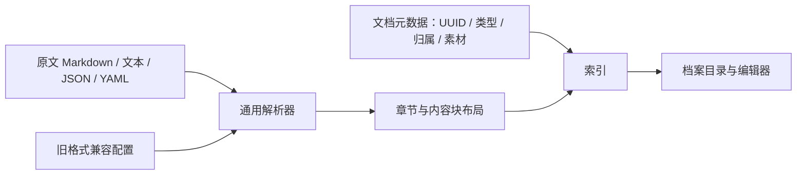

# 通用 OC 文档模型

Viento Studio 的内容模型以源文结构为准。文档类型用于分类，不规定“力量、技能、价格”等字段，也不指定卡片位置。



## 原文与布局

`scripts/standardize-docs/parser.mjs` 只识别标题、字段、段落、列表、表格、代码和 JSON/YAML 值；不读取本机作品配置，也不包含游戏字段名单。`layout.mjs` 按原文顺序生成 `viento-layout-v1` 分节。任意字段名、嵌套对象、数组、零、false 和 null 均保留。

例如下面的内容无需新增任何专用渲染器：

```markdown
# 星裔

## 生理特征
灵魂数量：2
寿命：未确定

## 社会关系
与人类共享城市，但使用不同的历法。
```

前端 `app-document-layout.js` 消费统一布局。模板只是新建文档的起点，模板没有列出的字段也可以使用。编辑区块始终取当前源文，保留未修改行的字节与换行格式；展示缓存不能反向覆盖原文。

## 可迁移的文档身份和归属

作品的 `metadata/documents/<UUID>.json` 保留原有 `id`、`sourcePath` 和 `assetBindings`，新增可选字段：

```json
{
  "format": "viento-document",
  "version": 1,
  "id": "11111111-1111-4111-8111-111111111111",
  "sourcePath": "design-data/stories/某角色的经历.md",
  "documentType": "story",
  "parserProfile": "prose",
  "relations": [
    {
      "kind": "part-of",
      "targetId": "22222222-2222-4222-8222-222222222222",
      "slot": "背景故事"
    }
  ],
  "assetBindings": []
}
```

- `documentType` 是开放字符串，可用 character、story、item 或自定义类型。
- `parserProfile` 为 structured（字段与正文）、prose（叙事正文）或 legacy-hero（历史游戏档案写法）。兼容规则仅在导入层生效；配置随元数据迁移，移动原文路径不会丢失解析方式。
- `part-of` 表示内容归属，`targetId` 必须指向同一作品中已登记的文档。其他关系类型可保留引用语义。
- 一个文档可以归属多个档案。共用背景只保存一份正文，编辑后各归属方看到相同内容。
- 循环归属、重复关系、未知 ID 在登记验证时拒绝。已登记的父文档源文件暂时缺失时，索引保持子文档可见。

源文件可继续分开存储。界面将归属内容放在父档案目录下，并提供“基本档案 / 背景故事”导航；支持多层归属，例如角色 → 背景 → 经历片段。每个入口使用原来的源文件读写、并发版本校验和未保存切换保护。搜索附属正文时能找到所属档案。作品级故事没有角色归属，仍按原章节查看。

## 旧元数据整理

```sh
npm run workspace -- migrate-documents
npm run workspace -- migrate-documents --shared-owners /完整路径/归属映射.json --write
npm run rebuild
```

默认只输出计划。`--write` 保留全部文档 ID、原文、素材绑定和路径，仅补充元数据；先在作品 `.viento/migrations/` 记录修改前后描述，再持登记锁原子替换每份描述文件。重复执行不产生新身份或重复关系。

旧角色背景只对同属性目录、同文件名且唯一匹配的角色建立归属。独立故事目录、存在歧义或缺少角色的背景保持可见，并列入计划的 unresolved。共用背景使用显式的源路径映射，角色名称不写入程序代码：

```json
{
  "design-data/backstory/分组/共用背景.txt": [
    "design-data/design-heros/分组/角色甲",
    "design-data/design-heros/分组/角色乙"
  ]
}
```

旧的 `--merge-backstory` 参数仍可接受，但不再改变内容归属。归属由作品元数据决定，全量、局部重建和迁移后均一致。标准化缓存不复制角色背景到另一份可编辑文档。

## 验证

回归覆盖：核心解析与路径无关、自定义字段与类型、嵌套类型值、属性逐行显示、独立章节不算角色、按 ID 归属、共用背景、歧义与循环、元数据整理幂等、背景独立保存后的局部重建，以及移动到新作品路径后的关系保持。

文档、元数据和素材继续存放在应用数据目录。迁移包包含完整 metadata；解析布局和索引属于可重建缓存。历史迁移包代表导出时的作品状态，整理元数据后可从作品库重新导出新包。
